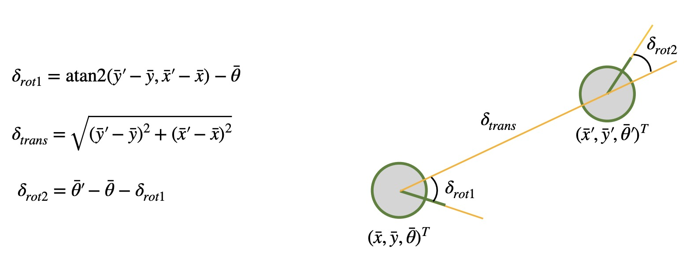
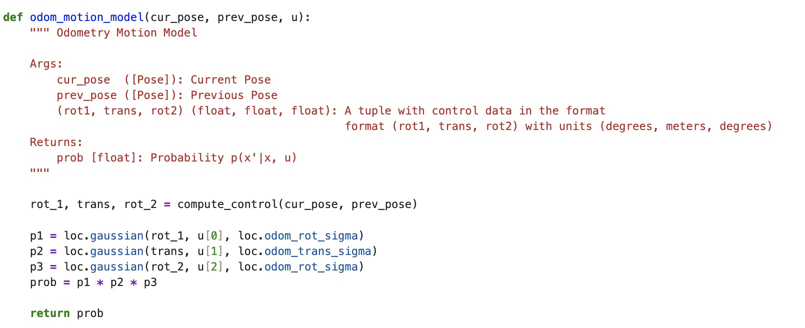
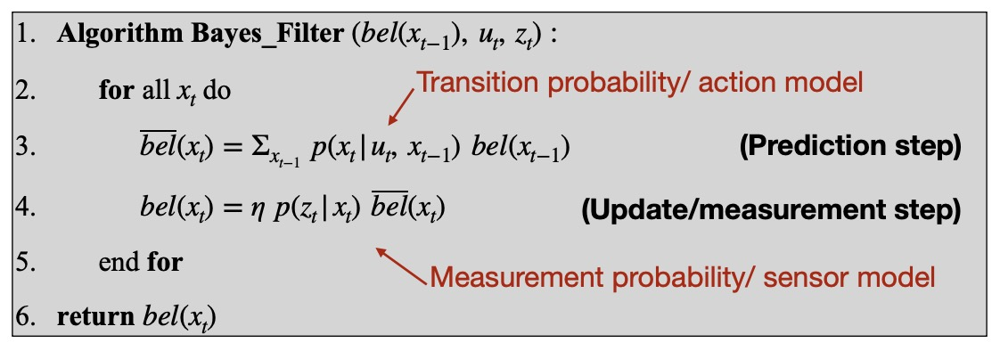
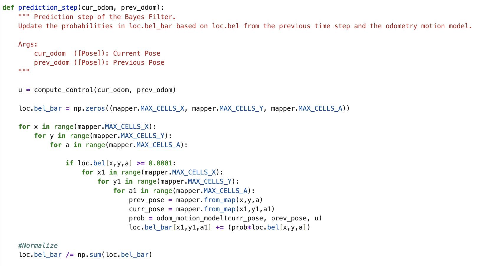
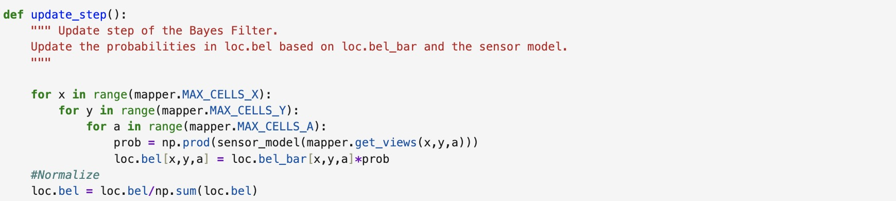

# Lab 10: Grid Localization using Bayes Filter

In this lab, I simulate grid localization using the Bayes filter algorithm in Python. Grid localization is the process of determining the position of a mobile robot within a known map of its environment that has been divided into a grid.

I use a Gaussian Distribution to model the measurement noise, which can be thought of as a simplified Beam model where noise from failures, unexpected objects, and random measurements are omitted. I use the odometry motion model with the Gaussian noise model and record data before and after each movement. The relative motion parameters are described by variables rotation1, translation, and rotation2. Using the Bayes filter algorithm, I can localize the robot. There are two steps: a prediction step to incorporate control input data (movement) and an update step to incorporate observation data (measurement).

## Simulation Code

### compute_control function

The compute_control function computes the odometry model parameters shown below from Professor Helbling's slides) and computes control input u given the pervious pose at time t-1 and current pose at time t.

The model parameters in the Python code delta_rot_1, delta_trans, and delta_rot_2 are computed from the current and previous poses passed into the function.

### odom_motion_model

The odom_motion_model function calculates the probability of the robot transitioning from the previous pose to the current pose by plugging in The actual and modeled control inputs into a Gaussian function.

### prediction_step

The prediction_step function simply implements the prediction step of the Bayes Filter Algorithm. The previous functions are used to support the implementation. It uses the current and previous odometry readings and motion model parameters to predict the robot's new belief. This is done by looping through all possible previous and current pose combinations and calling odom_motion_model to compute probabilities that are accumulated and normalized to add up to 1. To speed up this computationally intensive process, only probabilities over 0.0001 contribute to the belief. The tradeoff is that we lose a bit of accuracy.

### sensor_model
The sensor_model function calculates the likelihood of each observation based on a Gaussian distribution.

### update_step
The update_step function performs the update step of the Bayes filter by multiplying the measurement probability with the predicted belief to get the belief.

## Simulation Results
In the simulation plots, the odometry model is plotted in red, ground truth in green, and belief in blue (only shown for localization with Bayes). As shown in the video below, the odometry model alone is pretty inadequate as points are drawn outside the map boundary. When we add the Bayes filter to the localization simulation, we can see that the belief approximates the robot's true position very well as it tracks the ground truth plot.

### Localization Without Bayes Filter
<iframe width="560" height="315" src="https://www.youtube.com/embed/smKoO4KSoWQ" frameborder="0" allow="accelerometer; autoplay; encrypted-media; gyroscope; picture-in-picture" allowfullscreen></iframe>

### Localization With Bayes
<iframe width="560" height="315" src="https://www.youtube.com/embed/tBCk44oePKg" frameborder="0" allow="accelerometer; autoplay; encrypted-media; gyroscope; picture-in-picture" allowfullscreen></iframe>

___
## References
 I referenced pages written by Daria, Mikayla, and Stephan. I also referenced Professor Helbling's and Professor Peterson's slides. Lastly, I discussed ideas with Becky and Akshati.
