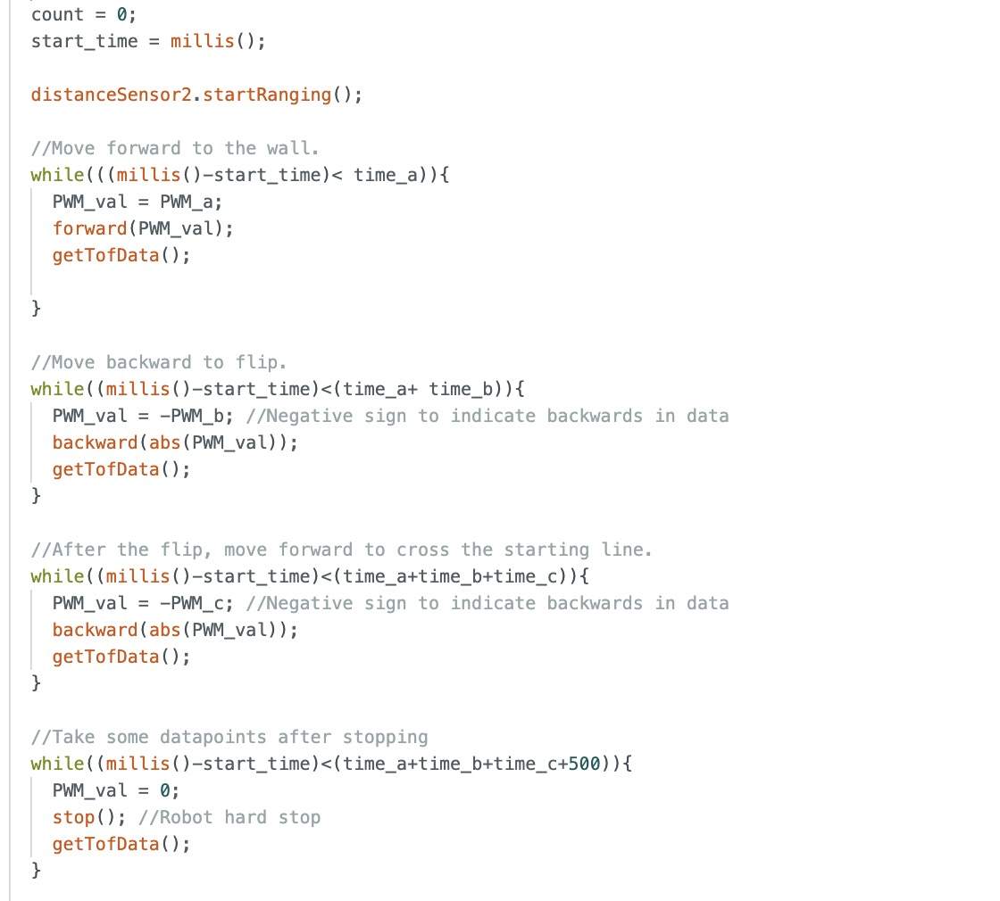
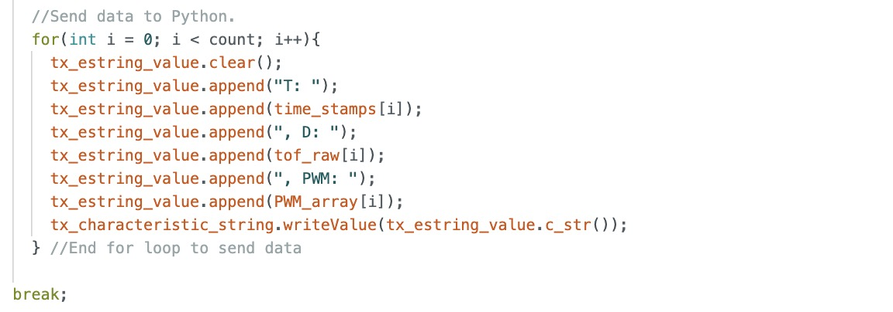
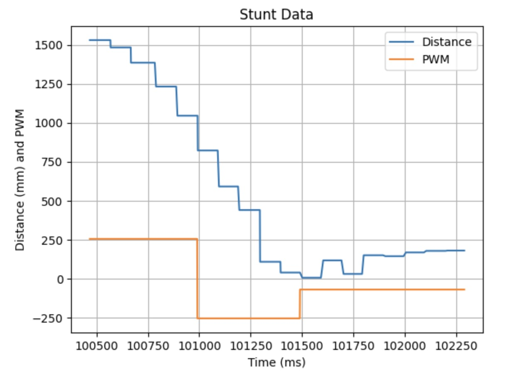

# Lab 10: Simulation

## Flip Implementation

**Arduino Code:**

Helper Function For Storing data:

**Python Command:**

## Flip Videos

### Flip Run 1
**Stunt Completion Time:** 1.93s

<iframe width="560" height="315" src="https://www.youtube.com/embed/XyZOh4HU9a8" frameborder="0" allow="accelerometer; autoplay; encrypted-media; gyroscope; picture-in-picture" allowfullscreen></iframe>

___

### Flip Run 2
**Stunt Completion Time:** 2.08s

<iframe width="560" height="315" src="https://www.youtube.com/embed/IG5O3Za6K4k" frameborder="0" allow="accelerometer; autoplay; encrypted-media; gyroscope; picture-in-picture" allowfullscreen></iframe>

___

### Flip Run 3
**Stunt Completion Time:** 2.00s

<iframe width="560" height="315" src="https://www.youtube.com/embed/H5lXT2y9cxg" frameborder="0" allow="accelerometer; autoplay; encrypted-media; gyroscope; picture-in-picture" allowfullscreen></iframe>

___

## Bloopers

<iframe width="560" height="315" src="https://www.youtube.com/embed/PDJ9GCCFWjM" frameborder="0" allow="accelerometer; autoplay; encrypted-media; gyroscope; picture-in-picture" allowfullscreen></iframe>

___
## References
 I referenced Wenyi's page. I discussed ideas with Becky and Akshati.
