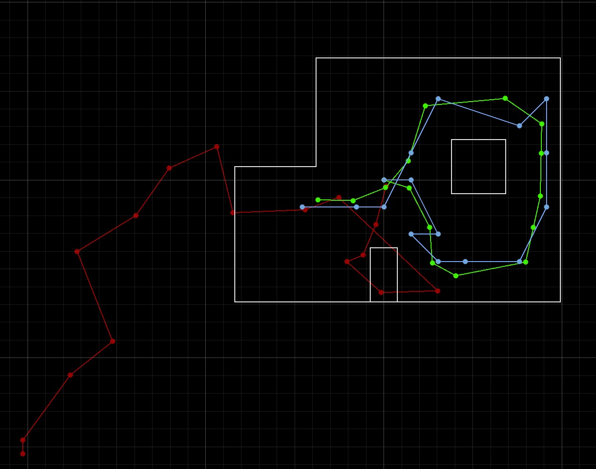

# Lab 11: Localization on the Real Robot

In this lab, I implemented localization on my physical robot using a simplified Bayes filter. Due to the large amount of motion noise inherent in low-cost robots, the prediction step is omitted, as it provides little benefit and adds unnecessary computational overhead. Instead, the algorithm relies solely on the update step, which utilizes 360-degree scans from the ToF sensor.

I was provided with Jupyter notebooks containing a working Bayes filter implementation for a virtual robot. My task was to adapt and modify this code to function correctly on my real robots.

## Simulation

I tested the localization simulation in the provided lab 11 notebooks from Professor Helbling. The results are shown below. The red is odometry, green is ground truth, and blue is belief.  

## Implementation

### Localization With Bayes
<iframe width="560" height="315" src="https://www.youtube.com/embed/tBCk44oePKg" frameborder="0" allow="accelerometer; autoplay; encrypted-media; gyroscope; picture-in-picture" allowfullscreen></iframe>

___
## References
 I referenced Daria's page. I also referenced Professor Helbling's and Professor Peterson's slides. Lastly, I discussed ideas with Becky and Akshati.
