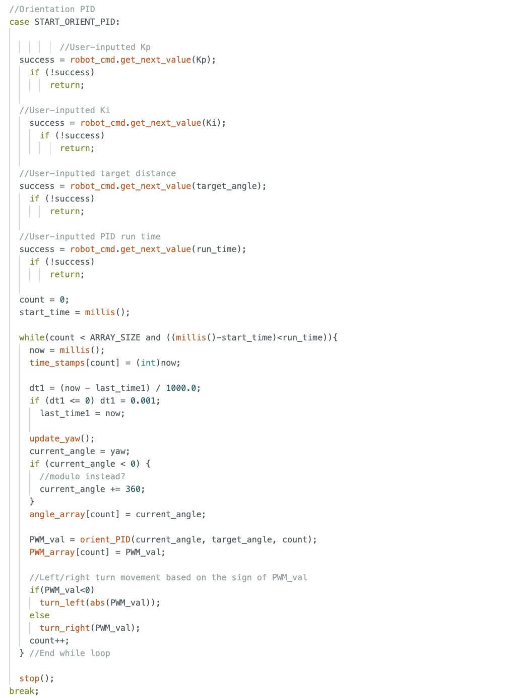

# Lab 12: Path Planning and Execution

In this lab, our objective was to program the robot to follow a predefined path on the map, starting at coordinate (-4, -3) and ending at (0, 0), with stops and localization performed at each waypoint. Due to time constraints, we only collected localization data at the starred points and skipped the coordinate (5, -2), as it lay directly between the straight path from (5, -3) to (5, 3). While we didn’t use localization to guide the robot’s movement, we used it to verify the accuracy of our belief estimates with Bayes.

## Method
I used Arduino code from the previous labs and called my commands from Python to complete this lab. We only used four Arduino commands: LINEAR_PID, FORWARD, and START_ORIENTATION_PID. I did not do any localization

## Arduino Code

## Python Code

### Path Execution
<iframe width="560" height="315" src="https://www.youtube.com/embed/EpykFcLn-yE" frameborder="0" allow="accelerometer; autoplay; encrypted-media; gyroscope; picture-in-picture" allowfullscreen></iframe>

___
## Notes and References
Initially, I planned to use my own robot, but I discovered that both of my time-of-flight sensors had stopped functioning—likely due to damage from the impact of my flip stunts. Code that had previously worked began returning either zero or erratic distance readings. The day after the ECE Robotics showcase, where I demonstrated the stunt, the serial monitor reported wiring issues with both sensors. With limited time and no opportunity to resolder the connections, I decided to partner with Becky. I also discussed ideas on a high level with Akshati. We did not use outside references.
