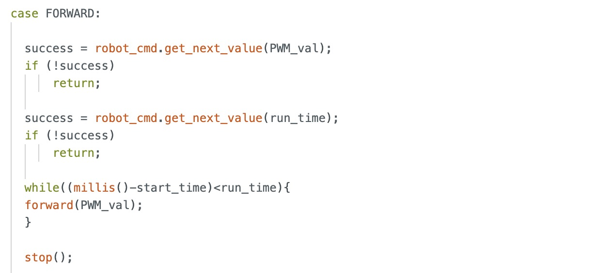
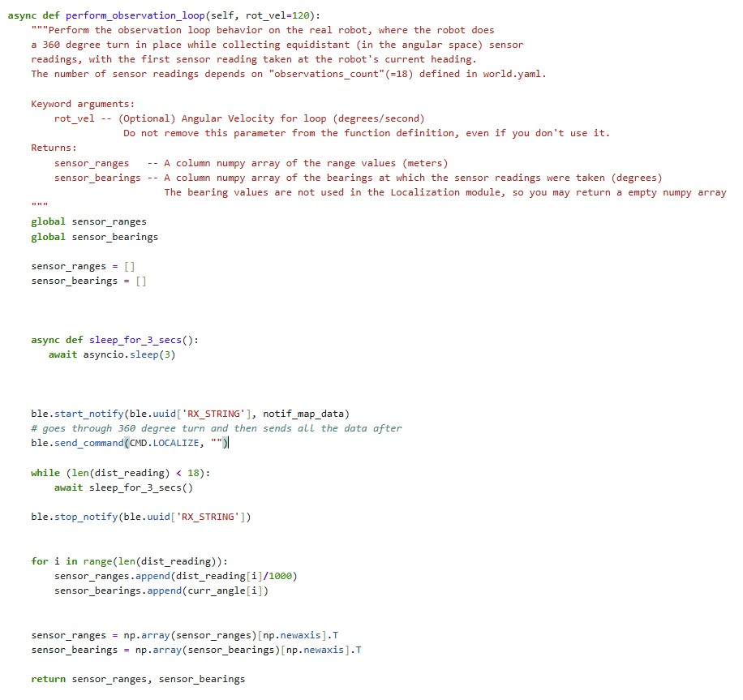

# Lab 12: Path Planning and Execution
In this lab, our objective was to program the robot to follow a predefined path on the map, starting at coordinate (-4, -3) and ending at (0, 0), with stops and localization performed at each waypoint. Due to time constraints, we only collected localization data at the starred points and skipped the coordinate (5, -2) when traversing our path, as it lay directly between the straight path from (5, -3) to (5, 3). While we didn’t use localization to guide the robot’s movement, we used it to verify the accuracy of our belief estimates with Bayes.

## Method
To execute the path shown above, we used open loop control for forward movement from coordinates (-4,-3) to (1,-1) and linear PI control for the rest of the path legs. We used orientation PI control for every turn. We used Arduino code from the previous labs and called my commands sequentially from Python to complete this lab. Our path execution method required only three Arduino commands: LINEAR_PID, FORWARD, and START_ORIENT_PID. (**Note:** I never implemented the D term so these commands should be named PI, but there are too many instances where these command names are used, so I never renamed them.) Although we collect data for localization using our LOCALIZATION command, we do not actually use it in our path execution.

## Arduino Code

### FORWARD Command
The FORWARD command accepts a PWM value and duration as user inputs and moves the robot forward accordingly for the specified time at the given speed. The forward() function comes from my Lab 4 code.

### LINEAR_PID Command
The LINEAR_PID command takes in user inputs for Kp, Ki, the target distance (setpoint), and the run_time, then executes the linear PID control accordingly. The run_time variable determines how long the while loop continues to compute the PI output, and we adjust it based on what we consider appropriate for each leg. The linear_PID() function is reused from my Lab 5 code.

### START_ORIENT_PID Command
The START_ORIENT_PID command is structured the same way as my LINEAR_PID command except we take a target angle as our setpoint. The orient_PID() function is reused from my Lab 6 code. 

### LOCALIZATION Command

## Python Code

### Localization Observation Loop

### Update Step

### Final Run Code

### Path Execution
<iframe width="560" height="315" src="https://www.youtube.com/embed/EpykFcLn-yE" frameborder="0" allow="accelerometer; autoplay; encrypted-media; gyroscope; picture-in-picture" allowfullscreen></iframe>

___
## Notes and References
Initially, I planned to use my own robot, but I discovered that both of my time-of-flight sensors had stopped functioning—likely due to damage from the impact of my flip stunts. Code that had previously worked began returning either zero or erratic distance readings. The day after the ECE Robotics showcase, where I demonstrated the stunt, the serial monitor reported wiring issues with both sensors. With limited time and no opportunity to resolder the connections, I decided to partner with Becky. I also discussed ideas on a high level with Akshati. We did not use outside references.
