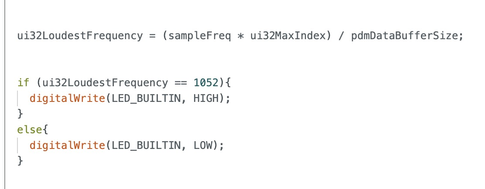

# Lab 1A: Artemis Board
The goal of this lab was to gain hands-on experience with the Redboard Artemis Nano board and the Arduino IDE by exploring built-in examples and writing a short program to utilize the board's hardware.

## Prelab

In the prelab, I installed the latest version of the Arduino IDE and Sparkfun Apollo3 Board’s manager. To complete the latter step, I copied the json link from [here](https://learn.sparkfun.com/tutorials/artemis-development-with-the-arduino-ide/setting-up-the-arduino-ide) and added it to my Arduino settings.

To start this lab, I connected the Artemis board to my computer via USB. I ran the following examples listed below and have attached the corresponding videos.

## Task 1: Blinky
Blinky switches the onboard LED on and off. Click on the video below to watch.

## Task 2: Serial

This example was used to test and verify serial communication  between the board and my computer, which is crucial for debugging as it enables us to monitor the system's activity. This particular example prints a few statements before prompting the user for input, which the program then echoes back.

## Task 3: Temperature Readings With Analog Read

This example displays temperature readings from the onboard sensor on the serial monitor. When I apply heat, the temperature readings rise, indicating that the sensor is functional and the analog read function processed the data properly on the microcontroller.

## Task 4: Microphone Output

This example displays the loudest frequencies detected by the microphone on the serial monitor. When I make a noise, the frequency changes printed on the serial monitor are obvious.

## Task 5 (ECE5160): C Note Detection With LED Indication

In this program, the LED lights up when the board detects the frequency of the C note and stays off for all other frequencies. I added a conditional statement in the printLoudest function to compare the detected frequency to C. If they match, the LED pin is set high. Otherwise, it is set low.

## Discussion

This lab was helpful in familiarizing myself with the peripherals and functionality of the Artemis Board Nano, including sensor data acquisition to audio processing and communication tasks. This will be essential for upcoming labs when we integrate the Artemis board on our robot.
