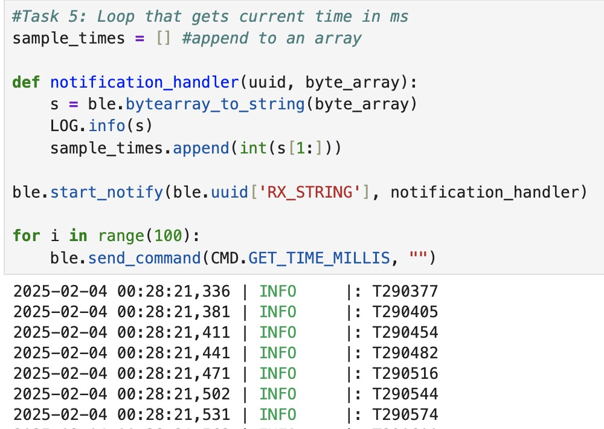
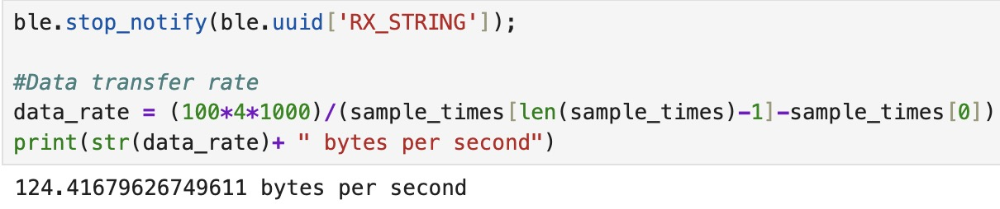
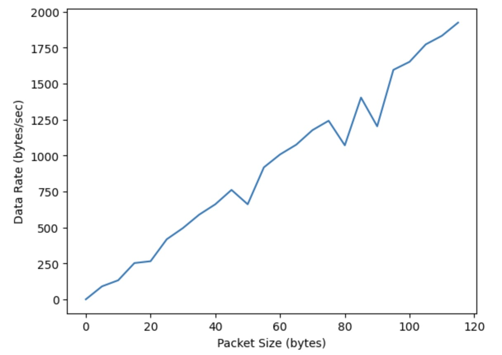

# Lab 1B: Bluetooth

The objective of this lab is to set up Bluetooth communication between my computer and the Artemis board, and to create a framework for exchanging data between them that can be adapted for future labs.

## Prelab

### Computer Setup
I followed the steps below to set up my computer.

1. Install Python 3 and pip.

2. Install a virtual environment by running the following commands in Terminal or any available command line interface (CLI). Run the second command in the desired project directory.

 python3 -m pip install --user virtualenv

 python3 -m venv FastRobots_ble

 3. To activate or deactivate the virtual environment use commands below.

 source FastRobots_ble/bin/activate

 deactivate

 4. Install bleak Python packages while the virtual environment is activated.

  pip install numpy pyyaml colorama nest_asyncio bleak jupyterlab

### Code Base

### Jupyter Server and Board Setup

### Configurations

## Lab Tasks

### ECHO Command
The ECHO command sends a string value from the computer to the Artemis board. In response, the board augments the string and sends it back to the computer, which then prints it.

The case statement for the ECHO command in Arduino is shown below.

The echoed response sent from the Artemis board to Python is shown below.

### SEND_THREE_FLOATS Command
This command sends three float values to the Artemis board, but does not expect a response. The goal was to extract these values in Arduino so that they may be used later.

Here is the command being sent in Python.

Here is the case statement for this command in Arduino.

The float values were printed in the serial monitor to verify that they were extracted successfully.

### GET_TIME_MILLIS Command
When this command is sent, the Artemis board transmits a string containing the time with prefix "T" to the computer.

Here are the results shown in Python.

Here is the case statement for the command in Arduino.

### Notification Handler
When the notify mechanism in BLE is enabled, the Artemis board can automatically send updated values to the computer without requiring explicit commands. The notification handler receives String values sent from the Artemis and the time gets extracted in the callback function.

### Live Time Data
I wrote a loop in Python to send the GET_TIME_MILLIS command 100 times, with each timestamp providing 1 byte of data, to measure the data transfer rate. In my notification handler, I stored the timestamps in an array and also logged the values in real-time for reference. To calculate the data rate, I used the first and last timestamp to determine the total time taken to transmit 100 bytes of data.

### SEND_TIME_DATA Command
In Arduino, I defined a global array to store time stamps. In the SEND_TIME_DATA case statement, the array is populated with time stamps in the first loop. In the second loop, each element is sent an a string to my computer, where it is then processed in Python by the notification handler like before.

### GET_TEMP_DATA Command
In Arduino, I defined a second global array to store temperature readings. Each element in the timestamp array will store the time corresponding to its respective temperature reading in the temperature array. In the GET_TEMP_DATA case statement, I followed the same framework as the SEND_TIME_DATA command. The first loop populates the arrays, while the second loop concurrently iterates through both arrays, sending the corresponding timestamps and temperature readings as strings to the computer.

In Python, the notification handler parses the strings, separating the time and temperature values into two separate arrays.

### Advantages and Disadvantages of Data Transmission Methods
The first method streams data for near real-time results but loses points when sensors outpace Bluetooth transmission, as observed in live data logs.The second method transmits data in batches, ensuring a higher data rate and preventing data loss which makes it more accurate. (Finish this)

The Artemis board has 384 kB of RAM. Assuming each data point is 4 bytes if we choose to send floats or ints, then approximately 96,000 data points can be stored before running out of memory.

### Effective Data Rate and Overhead
I measured and plotted the data rate for different packet sizes. The data rate for the 120 byte packet
is just under 2000 bytes per second while the rate for a 5 byte packet is about

### Reliability

## Discussion

In this lab, I gained a deeper understanding of Bluetooth communication and how to utilize the BLE libraries for its implementation. I initially struggled with the notification handler's purpose but realized it's useful for large datasets, eliminating the need for repeated commands to receive data points.
