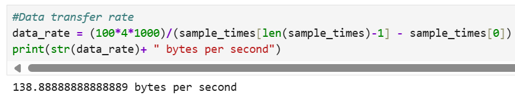

# Lab 1B: Bluetooth

The lab objective is to set up Bluetooth communication between my computer and the Artemis board, and to create a framework for data exchange that can be adapted for future labs.

## Prelab

### Computer Setup
1. Install Python 3 and pip.

2. Install a virtual environment by running the following commands in Terminal or any available command line interface (CLI). Run the second command in the desired project directory.

 python3 -m pip install --user virtualenv

 python3 -m venv FastRobots_ble

 3. To activate or deactivate the virtual environment use the commands below.

 source FastRobots_ble/bin/activate

 deactivate

 4. Install bleak Python packages while the virtual environment is activated.

  pip install numpy pyyaml colorama nest_asyncio bleak jupyterlab

 5. After installation, start Jupyter Lab by running jupyter lab in the CLI while the virtual environment is activated.

### Code Base
This codebase enables Bluetooth Low Energy (BLE) communication between an Arduino-based Artemis board and a Python program on a computer. A Jupyter notebook on the computer sends commands and interacts with the board over BLE. The ble_arduino.ino file runs on the board, receiving and executing commands.

### Board Setup
Burn ble_arduino.ino onto the Artemis and set the serial monitor baud rate to 115200 bps to find its MAC address.

### Configurations
In connections.yaml, add the Artemis MAC address and a new UUID generated in Python.

Add the UUID in ble_arduino.ino as well.

To create a new command, add it to cmd_types.py and enum Command Types in Arduino, making sure they match.

## Lab Tasks

### ECHO Command
The ECHO command sends a String from the computer to the Artemis board. In response, the board augments the String and sends it back to the computer, which then prints it.

Case statement Arduino:

Echoed response from the Artemis board to Python:

### SEND_THREE_FLOATS Command
This command sends three float values to the Artemis board, but does not expect a response. The goal is to extract these values in Arduino so they may be used later.

Command sent in Python:

Case statement in Arduino:

The float values were printed in the serial monitor to verify they were successfully extracted.

### GET_TIME_MILLIS Command
When this command is sent, the Artemis board transmits a String containing the time in milliseconds with prefix "T" to the computer.

Results in Python:

Command case statement in Arduino:

### Notification Handler
When the notify mechanism in BLE is enabled, the Artemis board automatically sends updated values to the computer without requiring explicit commands. The notification handler receives String values sent from the Artemis and extracts the time in the callback function.

### Live Time Data
I wrote an Arduino loop to send 100 four-byte timestamps to measure the data transfer rate. In my notification handler, I stored the timestamps in an array and logged values in real-time for reference. To calculate the data rate, I used the first and last timestamp to determine the total transmission time.

Calculated data rate:

### SEND_TIME_DATA Command
In Arduino, I defined a global array to store time stamps. In the SEND_TIME_DATA case statement, the array is populated with time stamps in the first loop. In the second loop, each element is sent an a String to my computer, where it is processed in Python by a notification handler like before.

The data rate for this batch transmission method is shown below.

### GET_TEMP_READINGS Command
In Arduino, I defined a second global array to store temperature readings. Each element in the timestamp array will store the time corresponding to its respective temperature reading in the temperature array. In the case statement, I followed the same framework as the SEND_TIME_DATA command. The first loop populates the arrays, while the second concurrently iterates through both arrays, sending corresponding timestamps and temperature readings together to Python.

In Python, the notification handler parses the Strings, separating time and temperature values into two separate arrays.

### Advantages and Disadvantages of Data Transmission Methods
The first method streams data for near real-time results but loses points when sensors outpace Bluetooth transmission, as observed in live data logs.The second method transmits data in complete batches, ensuring a higher data rate and preventing data loss.

The Artemis board has 384 kB of RAM. Assuming each data point is 4 bytes if we send floats or ints, approximately 96,000 data points can be stored before running out of memory.

### Effective Data Rate and Overhead
I measured and plotted the data rate for different packet sizes. The data rate ~21 bytes/sec for the 5 byte packet and ~479 bytes/sec for the 120 byte packet.

Many short packets increase overhead because each has fixed overhead, resulting in less data per transmission. Larger packets reduce overhead by spreading it over more data, improving efficiency.

### Reliability
Sending data at a higher rate does not result in data loss. I sent large arrays with sequentially numbered element from Arduino and verified that all data points were received in Python.

## Discussion

In this lab, I gained an understanding of BLE and how to utilize BLE Arduino libraries for its implementation. I initially struggled with understanding the notification handler's purpose, but realized it is useful for large datasets, eliminating the need for repeated commands to receive data points.
