# Lab 3: Time of Flight (ToF) Sensors

## Prelab

**I²C address from [datasheet](https://cdn.sparkfun.com/assets/8/9/9/a/6/VL53L0X_DS.pdf):** 0x52

Since the I²C address is hardwired and both ToF sensors share the same address, I cannot address them individually without modifications. I wrote the second sensor's shutdown pin (XSHUT) low to disable it, changed the address of the first sensor, and then re-enabled the second sensor again to avoid address conflicts since they share the same bus.

Definitions:
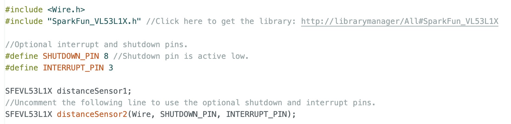

Setup function:
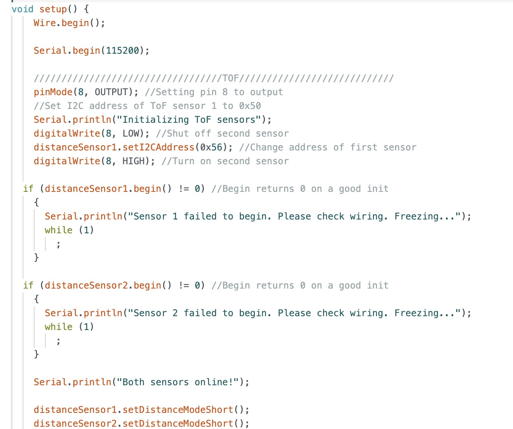

### Sensor Placement
I will mount one sensor on the front and another at a right angle on the side to expand the field of view, enhance depth perception, and improve multi-directional object detection.

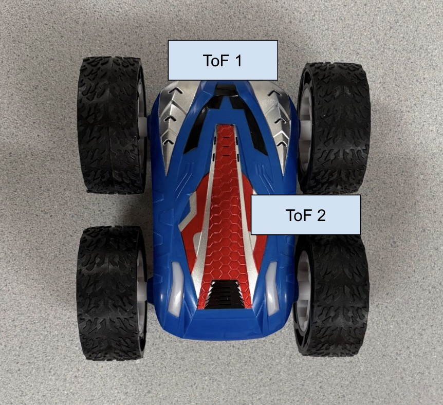

### Wiring Diagram
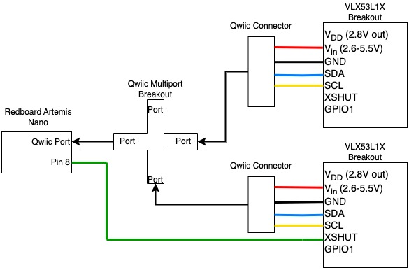

## Lab Tasks

The ToF sensors are connected as shown below. The Artemis board can be powered with a battery.

### Artemis Scanning for I2C Devices

The scanned address in the serial monitor does not match the datasheet because it shows only the part of the address that identifies the device, excluding the LSB, which indicates read/write.

### Sensor Data for Selected Distance Mode
I opted for the short-distance mode for the ToF sensors due because of its resolution at shorter distances and sufficient 1.3m range for the robot's navigation. It is also more immune to ambient light interference. In contrast, the long-distance mode can measure up to 4m but showed reduced accuracy under the bright lab lights during testing.

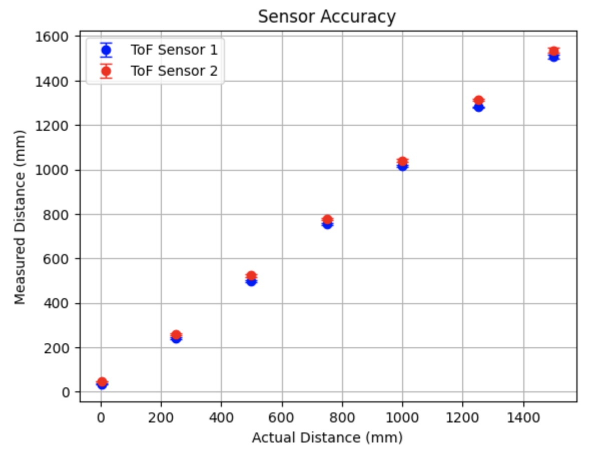

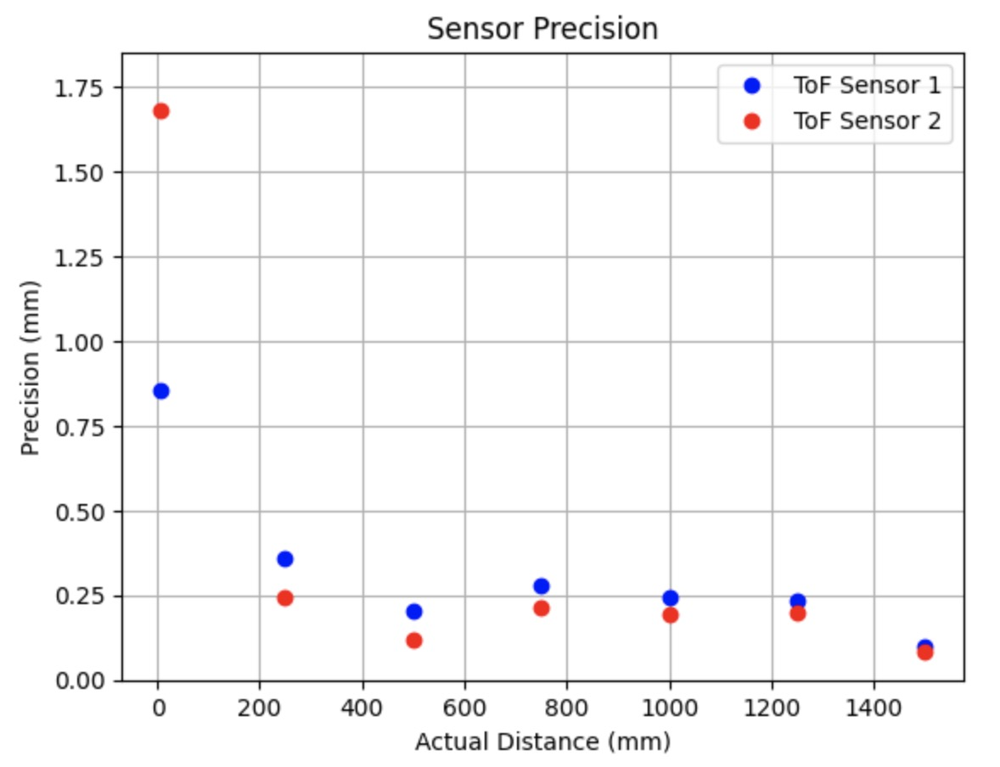

### ToF Sensor Speed
The code below outputs the Artemis clock to the Serial monitor and updates the ToF sensor data only when new data is available. Each loop iteration took 6 or 7 ms which is very fast. I expected some iterations to lack data, leading to a time difference between printing the timestamp alone and printing it with the data. I would assume the limiting factor would be due to the sensor measurements because the datasheet says they sample at 50Hz.

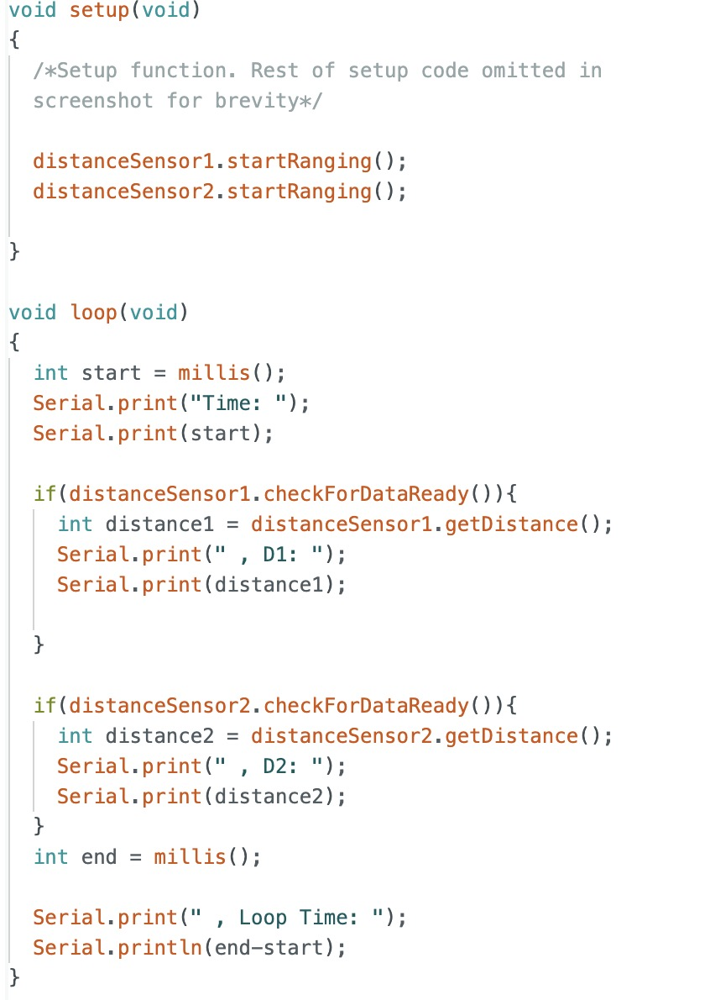

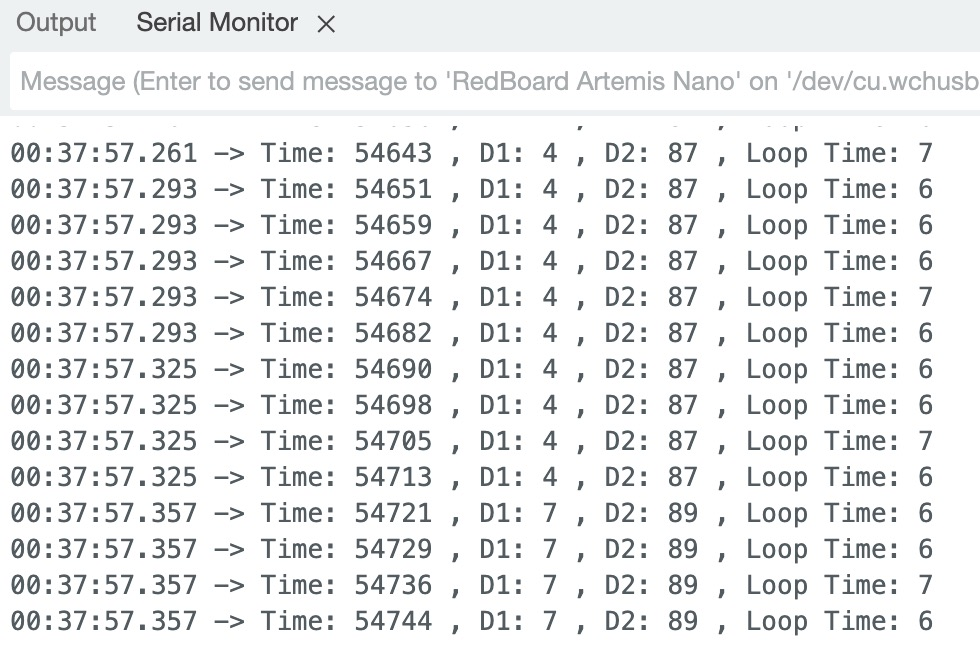

### Two ToF Sensors and IMU Working in Parallel
<iframe width="560" height="315" src="https://www.youtube.com/embed/PlbhDfo0RSo" frameborder="0" allowfullscreen></iframe>

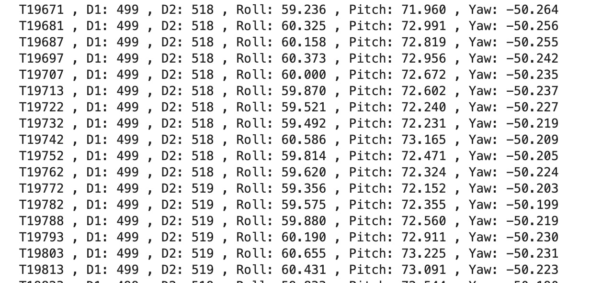

#### Time Vs. Distance
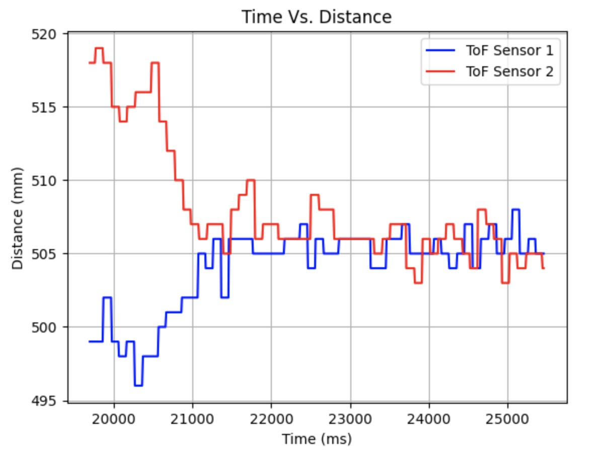

#### Time Vs. Angle
The IMU was kept still.

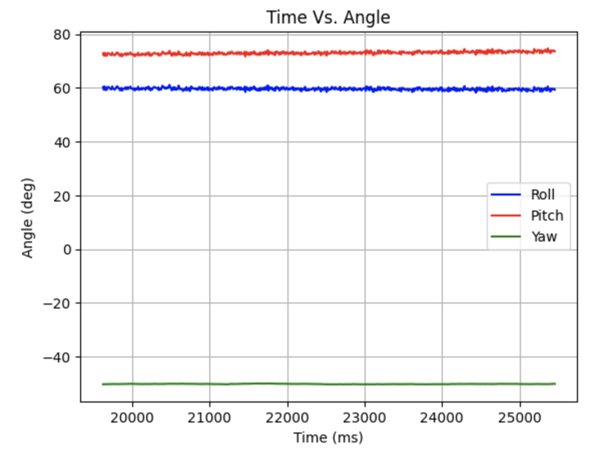

### Infrared Transmission Based Sensor Discussion

In addition to time-of-flight sensors, LiDAR and IR proximity sensors also rely on infrared transmission. LiDAR uses IR lasers to send pulses and measure return time. It is long range (meters to kilometers) and very precise and accurate, but more expensive and power-intensive. ToF sensors use IR LEDs or lasers and measure the time delay of reflected light which is suitable for medium ranges (centimeters to meters). They offer moderate accuracy and lower resolution than LiDAR, typically performing best at the centimeter scale. IR proximity sensors use IR LEDs to measure the reflected IR intensity. This is more suitable for short-range applications (a few centimeters to a meter) and cost-effective presence detection. They are not ideal for distance measurements because the reflected intensity varies with material properties.

### Sensitivity to Colors and Textures
I tested the ToF sensor's sensitivity to colors and textures by measuring distances at a fixed point with various materials.

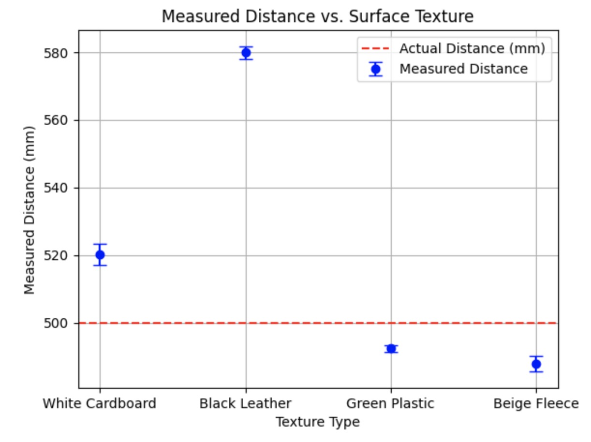

I anticipated that the distance measured with the white cardboard would produce the most accurate result, but it appears that the reflectivity of the green plastic was better despite its color. It's worth noting that the texture of the cardboard might also absorb some light, counteracting the reflective qualities of white. As expected, the black leather provided the least accurate measurement because its color is light-absorbing. I was surprised that fleece, with its inconsistent surface texture that can create variable reflections, performed second best.

# References
I referenced Wenyi's and Nila's pages for formatting content.
Sensor comparison sources:[Link1](https://www.spatialpost.com/lidar-vs-tof-time-of-flight-sensors), [Link2](https://pmt-fl.com/time-of-flight-sensor-vs-lidar-what-are-the-differences/), [Link3](https://www.spatialpost.com/lidar-vs-tof-time-of-flight-sensors/), [Link4](https://www.sony-semicon.com/en/technology/industrytof.html#:~:text=ToF%20depth%20sensors%20measure%20the,time%20elapsed%20between%20the%20two.)
