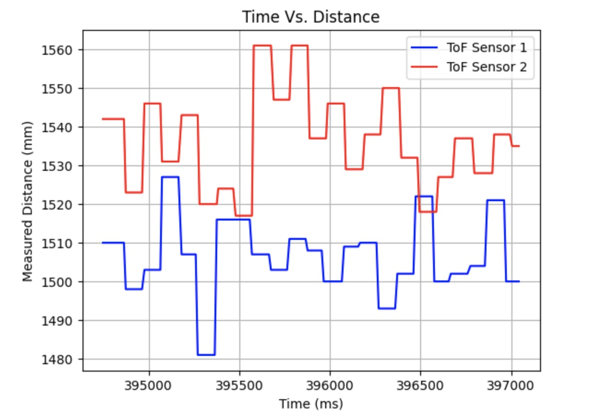

# Lab 3: Time of Flight (ToF) Sensors

## Prelab

**I²C address from [datasheet](https://cdn.sparkfun.com/assets/8/9/9/a/6/VL53L0X_DS.pdf):** 0x52

Since the I²C address is hardwired and both ToF sensors share the same address, I cannot address them individually without modifications. I wrote the second sensor's shutdown pin (XSHUT) low to disable it, changed the address of the first sensor, and then re-enabled the second sensor again to avoid address conflicts since they share the same bus.

Definitions:

Setup function:

### Sensor Placement
I will mount one sensor on the front and another at a right angle on the side to expand the field of view, enhance depth perception, and improve multi-directional object detection.

### Wiring Diagram

## Lab Tasks

The ToF sensors are connected as shown below. The Artemis board can be powered with a battery.

### Artemis Scanning for I2C Devices

The scanned address in the serial monitor does not match the datasheet because it shows only the part of the address that identifies the device, excluding the LSB, which indicates read/write.

### Sensor Data for Selected Distance Mode
I opted for the short-distance mode for the ToF sensors due because of its resolution at shorter distances and sufficient 1.3m range for the robot's navigation. It is also more immune to ambient light interference. In contrast, the long-distance mode can measure up to 4m but showed reduced accuracy under the bright lab lights during testing.

### Two ToF Sensors and IMU Working in Parallel

### ToF Sensor Speed

### Time Vs. Distance
I tried plotting time vs distance at two distances 50cm and 150cm (over the max range for short distance mode).

### Time Vs. Angle

### Infrared Transmission Based Sensor Discussion

In addition to time-of-flight sensors, LiDAR and IR proximity sensors also rely on infrared transmission. LiDAR uses IR lasers to send pulses and measure return time. It is long range (meters to kilometers) and very precise and accurate, but more expensive and power-intensive. ToF sensors use IR LEDs or lasers and measure the time delay of reflected light which is suitable for medium ranges (centimeters to meters). They offer moderate accuracy and lower resolution than LiDAR, typically performing best at the centimeter scale. IR proximity sensors use IR LEDs to measure the reflected IR intensity. This is more suitable for short-range applications (a few centimeters to a meter) and cost-effective presence detection. They are not ideal for distance measurements because the reflected intensity varies with material properties.

### Sensitivity to Colors and Textures
I tried experimenting with the following colors and textures: a black sheet of paper, my beige fleece sweater, and a white piece of cardboard.

It makes sense that measuring distance against the white cardboard would yield the most accurate result out of the three, because white can reflect the most light whereas black would absorb it. The inconsistent surface texture of fleece can create inconsistent reflections. Beige is also not as reflective as white.

# References
I referenced Wenyi's and Nila's pages for help with formatting content.
Sources for sensor discussion:[Link1](https://www.spatialpost.com/lidar-vs-tof-time-of-flight-sensors), [Link2](https://pmt-fl.com/time-of-flight-sensor-vs-lidar-what-are-the-differences/), [Link3](https://www.spatialpost.com/lidar-vs-tof-time-of-flight-sensors/), [Link4](https://www.sony-semicon.com/en/technology/industry/tof.html#:~:text=ToF%20depth%20sensors%20measure%20the,time%20elapsed%20between%20the%20two.)
