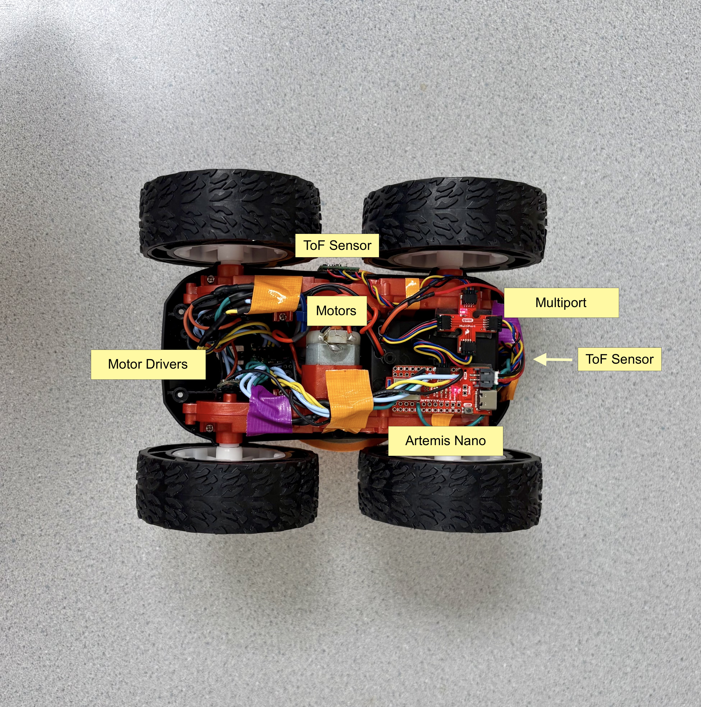
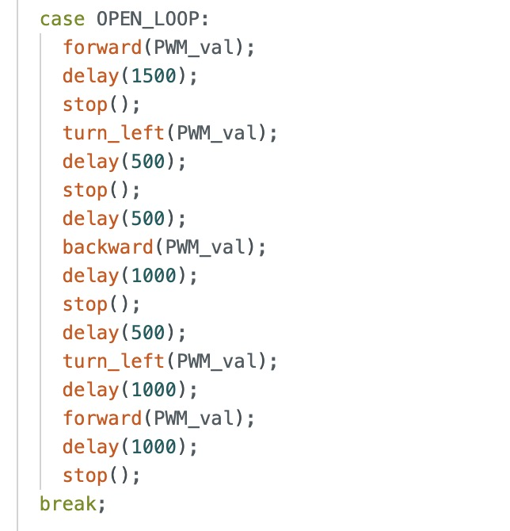

# Lab 4: Motors and Open Loop Control

## Prelab

### Wiring Diagram

I used pins A0-A3 on the Artemis to control the motors. The Artemis and the motors will be powered by separate batteries because the motors draw large currents, generating noise and inductive spikes when switched on and off.

(Turn this into a table) I used blue wires for the In1 pairs of for both motor drivers and and yellow wires for the In2 pair of the first

## Lab Tasks

### Motor Driver PWM Test
The motor driver circuit's operating voltage is 2.7-10.8VDC according to the [datasheet](https://www.pololu.com/product-info-merged/2130). The battery provided for the car is 3.7 V so I figured that would be a reasonable voltage for the power supply setting.

I used analogWrite commands to generate PWM signals on the motor driver inputs and scoped the outputs.

---

The output signal has a 3.7V amplitude, matching the power supply. This was consistent across all output pins on both drivers. An example oscilloscope image of one of the outputs is shown.

### Wheels Spinning On Each Side

<iframe width="560" height="315" src="https://www.youtube.com/embed/gqHCjJhukT0" frameborder="0" allow="accelerometer; autoplay; clipboard-write; encrypted-media; gyroscope; picture-in-picture" allowfullscreen></iframe>

---

<iframe width="560" height="315" src="https://www.youtube.com/embed/sWNrK5JfFV4" frameborder="0" allow="accelerometer; autoplay; clipboard-write; encrypted-media; gyroscope; picture-in-picture" allowfullscreen></iframe>

---

### All Wheels Spinning
After confirming my motor drivers worked with the power supply, I switched to battery power and verified that all wheels spun properly.

<iframe width="560" height="315" src="https://www.youtube.com/embed/O3TMd0nXmHE" frameborder="0" allow="accelerometer; autoplay; clipboard-write; encrypted-media; gyroscope; picture-in-picture" allowfullscreen></iframe>

---

### Secured Car Components
I secured the components into the car as shown.

I used duct tape to create straps that further secured the components by pressing the sticky sides together, leaving the ends adhesive for attachment.

### Motor Functions
Rather than repeatedly using analogWrite in my code, I created separate motor functions for stopping, moving forward, moving backward, and turning for both the left and right motors. I then combined these functions to control the car's overall movement in different directions. (Note: The cal_factor will be explained in a later section. For now, assume it is 1 in the following section, as calibration has not been performed yet.)

### Lower Limit PWM Value to Start Movement
I wrote simple bluetooth commands to be able to easily set the PWM value, start, and stop my robot from my computer. I determined the lower limit PWM values for moving forward and turning from rest. Below this limit, the car would jerk without moving, as the force generated wasn't enough to overcome static friction. Above the limit, the car would take some time to generate the necessary force and begin moving.

The lower limit PWM value to move the car forward from rest is 40.
<iframe width="560" height="315" src="https://www.youtube.com/embed/RK-kr2esMf0" frameborder="0" allow="accelerometer; autoplay; clipboard-write; encrypted-media; gyroscope; picture-in-picture" allowfullscreen></iframe>

The lower limit value to turn the car from rest is 100.
<iframe width="560" height="315" src="https://www.youtube.com/embed/YSZ5fRW4pGQ" frameborder="0" allow="accelerometer; autoplay; clipboard-write; encrypted-media; gyroscope; picture-in-picture" allowfullscreen></iframe>

### Calibration For Straight Line Movement
Since the right motor is more powerful and has less internal friction than the left, I edited my motor functions to apply a 1.52 calibration factor to the left side to ensure straight movement.

This factor was determined experimentally by using my bluetooth command SET_CALIBRATION which is shown.

Once I calibrated the left motor, I was able to get my robot to move in a straight line for 6ft (~1.83m).
<iframe width="560" height="315" src="https://www.youtube.com/embed/MOosLSU_nTk" frameborder="0" allow="accelerometer; autoplay; clipboard-write; encrypted-media; gyroscope; picture-in-picture" allowfullscreen></iframe>

### Open Loop Control Sequence
After verifying that my robot was able to move in a straight line, I wrote an open loop control program that includes some turns.

<iframe width="560" height="315" src="https://www.youtube.com/embed/qxFuCmpnBeI" frameborder="0" allow="accelerometer; autoplay; encrypted-media; gyroscope; picture-in-picture" allowfullscreen></iframe>

  
### Frequency Discussion for analogWrite
Using the oscilloscope picture from earlier, I estimate the frequency of analogWrite to be approximately 267Hz. According to Arduino documentation, microcontrollers typically operate at PWM frequencies of 490Hz, although the specific frequency for the Artemis Nano is not mentioned.

For controlling our inexpensive motors, this frequency is sufficient since very high precision and smooth control are not critical. However, at lower PWM frequencies, noise and vibrations tend to increase. By manually configuring the PWM frequency, these issues can be alleviated, resulting in quieter operation and potentially smoother control.

### Lower Limit PWM Value for Motion Maintenance
To determine the lower limit PWM value for maintaining motion after overcoming static friction, I created the following command. I began with the value for moving from rest and gradually decreased it in the loop until the robot stopped, identifying the lower limit for sustained movement. Bluetooth was used to send a 1 or 0, making it easier to switch between testing for sustained forward movement and turning. Each time the PWM value was decremented, the Artemis blinked, and I counted the blinks, observing when the car stopped to identify the corresponding PWM value.

The lower limit PWM value to maintain the car's forward motion is 39.
<iframe width="560" height="315" src="https://www.youtube.com/embed/PJNcoqZsU2c" frameborder="0" allow="accelerometer; autoplay; clipboard-write; encrypted-media; gyroscope; picture-in-picture" allowfullscreen></iframe>

The lower limit PWM value to maintain the car's turning motion is 95.
<iframe width="560" height="315" src="https://www.youtube.com/embed/5Ax-QaCJIuw" frameborder="0" allow="accelerometer; autoplay; clipboard-write; encrypted-media; gyroscope; picture-in-picture" allowfullscreen>
</iframe>

### References
I referenced Nila's and Wenyi's pages. I also discussed ideas with Becky.
Sources for analogWrite frequency discussion: [Improve Brushed DC Motor Performance: PWM Frequency](https://learn.adafruit.com/improve-brushed-dc-motor-performance/pwm-frequency) and [Arduino - analogWrite()](https://www.arduino.cc/reference/tr/language/functions/analog-io/analogwrite/)
.
