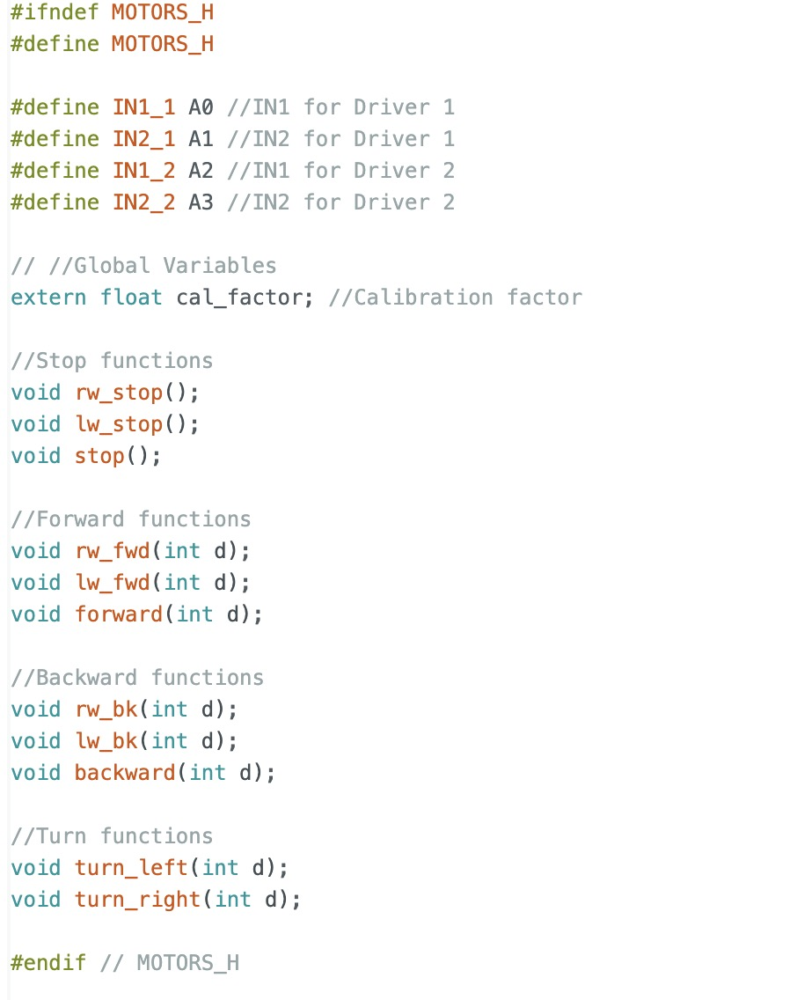
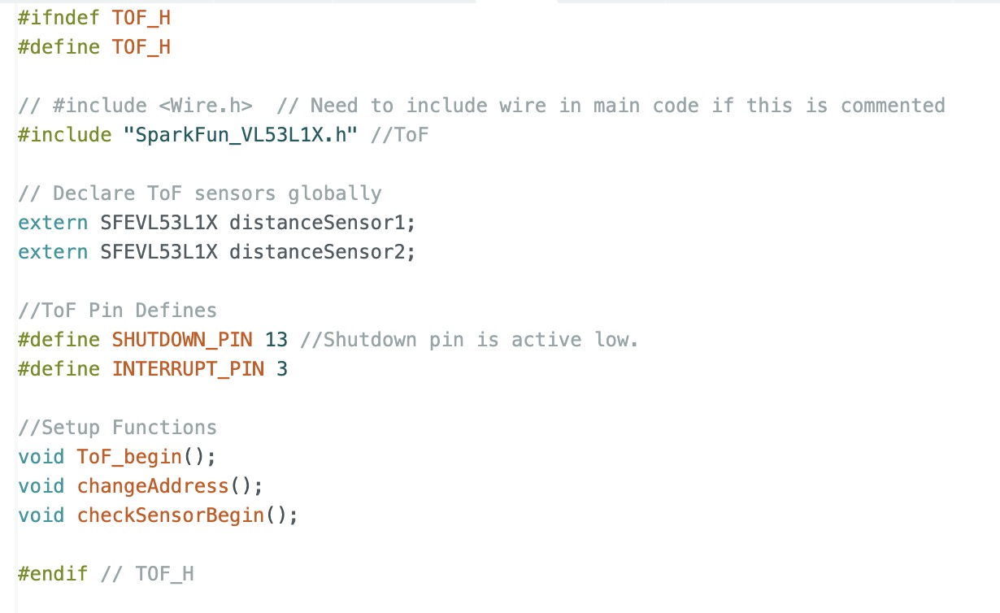
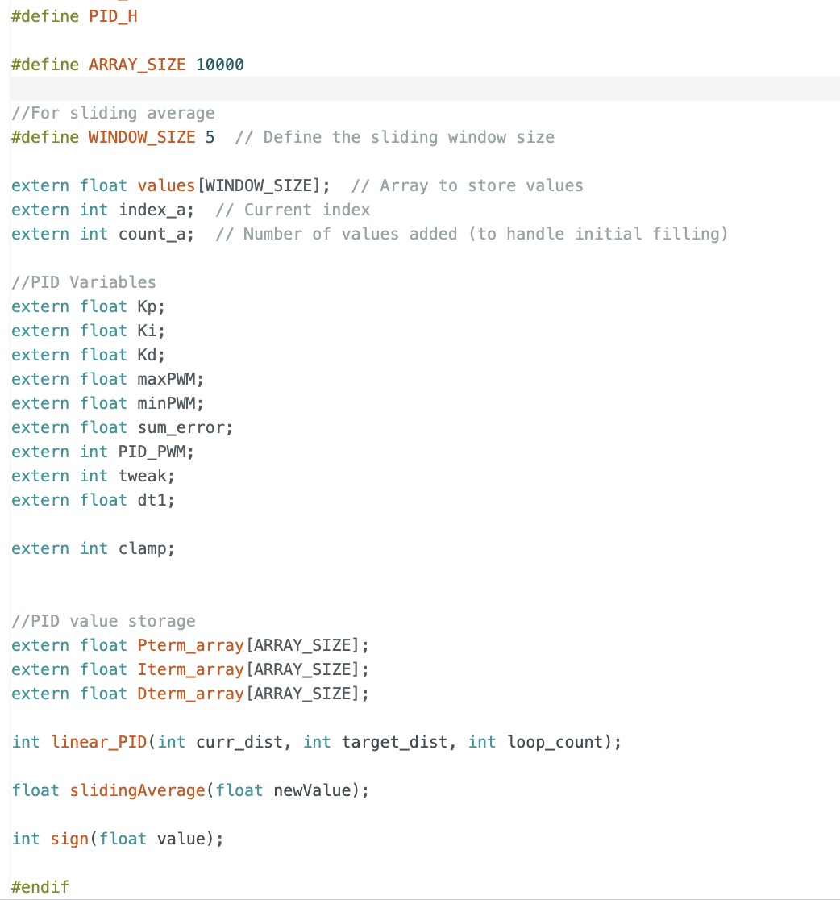
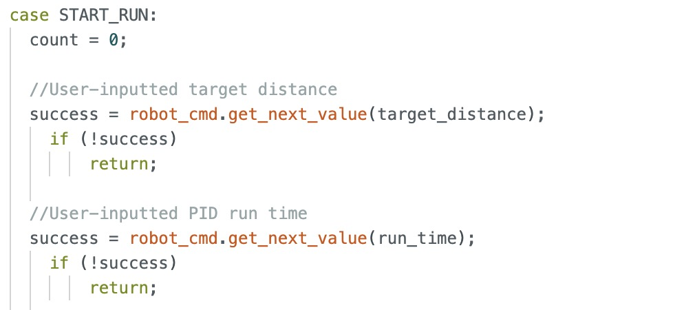
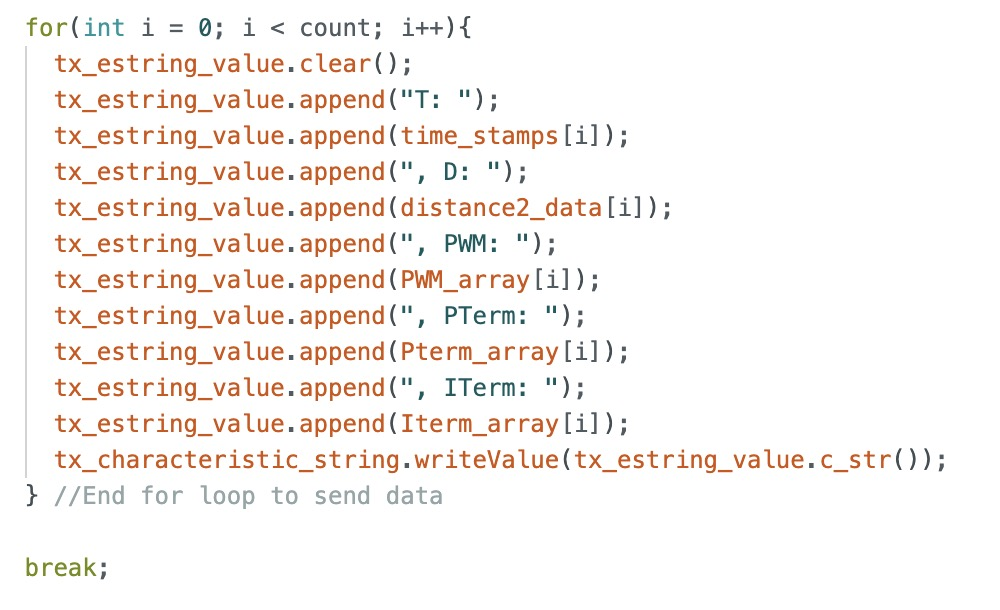
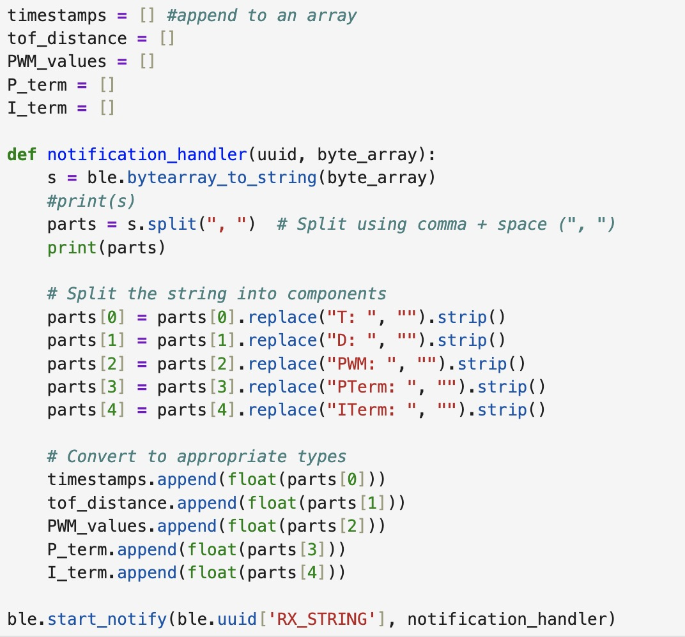
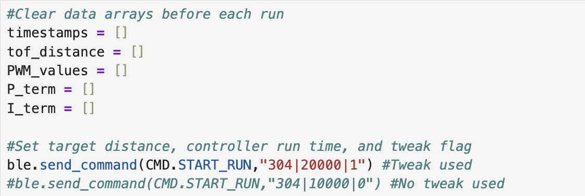
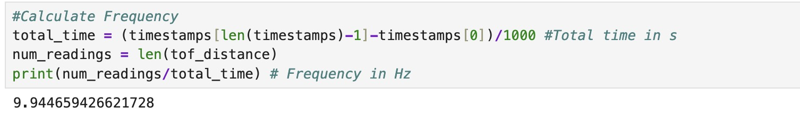
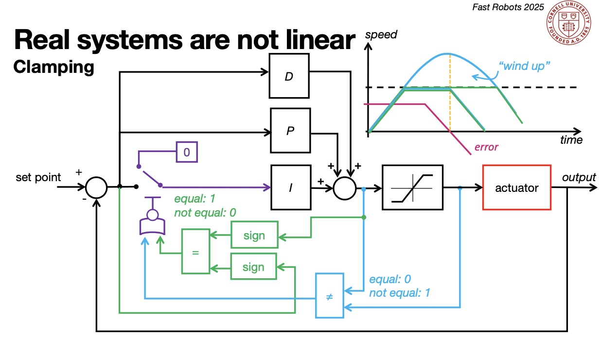
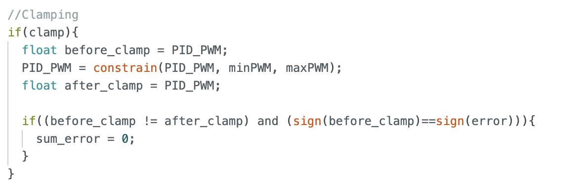

# Lab 5: Linear PID Control and Linear Interpolation
The objective of this lab

## Prelab
I began by separating my previous lab code for motor control and ToF into header and CPP files to improve code organization. Additionally, I created a new header file specifically for my PID control functions. Due to time constraints, I have not yet created a header file for my IMU code. The header files are shown below.

Motor header file:

ToF header file:

### Bluetooth Commands
Next, I wrote Bluetooth commands to set parameters and control the start and stop of my PID code from my computer.

The **SET_PID_PARAM** command sets PI parameters (Kp and Ki) and activates a tweak flag, which adjusts the PI calculation. This adjustment is discussed later in the implementation.

Arduino side:

Python side:

The **SET_CONSTRAINT** allows me to choose PWM value limits to cap speed and prevent the robot from hitting the wall too hard. I can also set the flag for clamp here which turns on and off clamping for wind-up protection.

Arduino side:

Python side:

The **START_RUN** command allows me to set the target distance (setpoint) and PID runtime, then executes PI control for the specified duration. The PI implementation will be discussed further in the implementation section. Lastly, it sends timestamped data, including distances, PWM values, P terms, and I terms, to the computer afterward for plotting.

Arduino side:

Python side:

I also implement a hard stop in the main loop if the Bluetooth connection fails as safety measure.

### PI Discussion and Implementation
The PID equation and block digram from Professor Helbling's slides are shown.

In essence, the PID control equation combines three components to adjust a system's behavior. The Proportional term responds to the current error, the Integral term accounts for past errors to eliminate steady-state error, and the Derivative term predicts future errors based on the rate of change. Together, these components work to minimize error and improve system stability and accuracy.

I implemented only PI control because, through experimentation, I found it sufficient to make the robot stop 1 foot away from the wall. The P term provided effective control, while the I term helped with fine-tuning the small and persistent errors. There are no substantial fluctuations or fast changes in the system that would necessitate the D term, particularly since there is no speed requirement for this lab.

In the START_RUN function, I use a while loop to implement PI control for the desired duration, ensuring ample data storage with arrays. I compute the time step (dt) for the integral control and then update the PI values using the linear_pid function, provided the ToF sensor has data.At the end of the loop, I manage forward and backward movement based on the sign of the adjusted PWM value from the PI calculation.

In my **linear_pid** function, I implement PI according to the equation. I also apply a tweak to the PID control when the flag is activated. This tweak takes a sliding average of the last five errors and checks if it is less than 50mm. If it is, the PWM value is set to 0, stopping the car. This ensures the car stops just before reaching its target distance, giving it enough time to come to a complete stop by the time it reaches the target. While the PID control equation should theoretically work as shown in the slides, in practice, this adjustment is necessary because my motors are imperfect.

I also include my clamping code for wind-up protection in my linear_pid function. The clamp flag, activated in SET_CONSTRAINT, controls the conditional that encompasses the clamping code.

## Lab Tasks

### Position Control

#### Proportional (P) Control
First, I implemented proportional control. I started with an estimate by calculating the following:
.
I rearranged the equation for PWM control and estimated Kp using the maximum PWM I allowed and the maximum error, based on the ToF sensor's 4m range.As always, the theoretical value requires adjustment to be suitable for practical application. I ended up tweaking this value to be lower through experimentation.

Kp = 0.04.

<iframe width="560" height="315" src="https://www.youtube.com/embed/6NMo0ybRPp8"
    frameborder="0" allow="accelerometer; autoplay; clipboard-write; encrypted-media; gyroscope; picture-in-picture"
    allowfullscreen>
</iframe>

___
#### Proportional Integral (PI) Control
After finding Kp, I loosely followed heuristic 1 in the slides and increased Ki until overshoot and then slowly reduced the Ki until it was gone. I primarily looked at the car's ability to reach the 1-foot mark with precision and accuracy, using this as a key indicator of effective tuning. I did end up lowering Kp as well after experimenting with the values further through trial and error.

PI control without clamping: Kp = 0.032 and Ki = 0.01

<iframe width="560" height="315" src="https://www.youtube.com/embed/x92iKCiqwtM" frameborder="0" allow="accelerometer; autoplay; encrypted-media; gyroscope; picture-in-picture" allowfullscreen></iframe>

Two other runs of my PI control are shown.

<iframe width="560" height="315" src="https://www.youtube.com/embed/TsQqXjffLiI" frameborder="0" allowfullscreen></iframe>

<iframe width="560" height="315" src="https://www.youtube.com/embed/44w_pQgWc-4" frameborder="0" allow="accelerometer; autoplay; encrypted-media; gyroscope; picture-in-picture" allowfullscreen></iframe>

___
### Extrapolation
Using the same methods from previous labs, I calculated the frequency at which the ToF sensor returns new data: ~9.94 Hz. This is very slow, but no matter how much I shortened the sensor's time budget, I could not get a faster frequency. I will need to look deeper into this.

After decoupling the ToF frequency from the PID loop by running the loop regardless of , I calculated the PID loop frequency to be ~121.25 Hz. To decouple the frequencies, I made the loop frequency dependent on the PID calculation rather than the sensor updates. When new ToF data is available, I updated the motor speed estimate; otherwise, I used the last saved value for PID calculations. This maintained continuous control without being constrained by the sensor's update rate.

#### Extrapolation Using Previous Datapoint
I extrapolated data using by using the previous data point if the ToF sensors is not currently ready with a reading. (Note: This is the loop I used to measure the decoupled PID loop frequency.)

#### Linear Interpolation
I implemented the linear interpolation equation below which uses the previous two datapoints to predict the next if the ToF sensor is not ready with a reading.

The graph for the raw data and the extrapolated data is shown.

### Wind-Up Protection for Integrator
The integrator term in my controller caused a wind-up issue. The accumulated error increased rapidly and could not shrink fast enough as the robot approached the target distance. This issue caused my car to drive directly into the cabinet as shown below.

#### No Wind-up Protection
<iframe width="560" height="315" src="https://www.youtube.com/embed/ITvxpkxNnqw" frameborder="0" allow="accelerometer; autoplay; encrypted-media; gyroscope; picture-in-picture" allowfullscreen></iframe>

#### Wind-Up Protection
To fix this issue, I implemented clamping in the code below using the logic shown in Professor Helbling's slides. The accumulated error is reset to 0 when the controller is clamped, helping to prevent oversaturation.

Two videos of my wind-up integrator protection code are shown (Kp=0.05 and Ki = 0.01).
<iframe width="560" height="315" src="https://www.youtube.com/embed/nPRK794NF8k" frameborder="0" allow="accelerometer; autoplay; encrypted-media; gyroscope; picture-in-picture" allowfullscreen></iframe>

<iframe width="560" height="315" src="https://www.youtube.com/embed/8rM_LcwEsAo" frameborder="0" allow="accelerometer; autoplay; encrypted-media; gyroscope; picture-in-picture" allowfullscreen></iframe>

___
## References
I heavily referenced Professor Helbling's slides. I also referenced pages written by Nila, Mikayla, and Stephen. I discussed ideas with Sabian and Becky.
