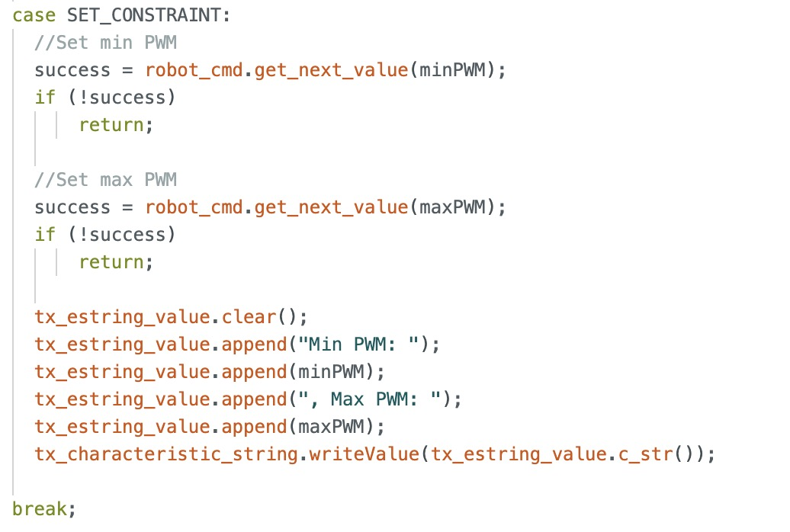

# Lab 5: Linear PID Control and Linear Interpolation

## Prelab
First, I separated my previous lab code for motor control and ToF into header and CPP files to improve code organization. Due to time constraints, I have not yet created a header file for my IMU code. The header files are shown below.

Motor header file:

ToF header file:

### Bluetooth Commands
Next, I wrote Bluetooth commands to allow parameter settings and control the start and stop of my PID code from my computer.

The **SET_PID_PARAM** command sets PI parameters (Kp and Ki) and activates a tweak flag, which adjusts the PI calculation. This adjustment is discussed later in the implementation.

Arduino side:

Python side:

The **SET_CONSTRAINT** command limits the PWM value to cap speed and prevent the robot from hitting the wall too hard.

Arduino side:

Python side:

The **START_RUN** command sets the target distance (setpoint) and PID runtime, then executes PI control for the specified duration. It sends timestamped data, including distances, PWM values, P terms, and I terms, to the computer afterward for plotting.

Arduino side:

Python side:

### PI Implementation
The PID equation and block digram from Professor Helbling's slides are shown.

I only implemented PI control because it was sufficient for reaching my goal of making the robot stop 1ft away from the wall.

## Lab Tasks

### Position Control

I started out by implementing P control.
P control only value:0.04.

PI control without clamping 0.032; 0.01

The distance is measured using the

Three videos of position control working are shown:

Video with P Control:
<iframe width="560" height="315" src="https://www.youtube.com/embed/6NMo0ybRPp8"
    frameborder="0" allow="accelerometer; autoplay; clipboard-write; encrypted-media; gyroscope; picture-in-picture"
    allowfullscreen>
</iframe>

Video with PI Control:
x3

#### Distance Graph
#### P Term Graph
#### I Term Graph

### Extrapolation
#### ToF Frequency
9.94 Hz

PID speed 121.25 Hz.

Video with old point
Video with extrapolation
###Wind-Up Protection for Integrator

Two videos of my wind-up integrator protection code are shown. I used Kp=0.05 and Ki = 0.01.
<iframe width="560" height="315" src="https://www.youtube.com/embed/nPRK794NF8k" frameborder="0" allow="accelerometer; autoplay; encrypted-media; gyroscope; picture-in-picture" allowfullscreen></iframe>

<iframe width="560" height="315" src="https://www.youtube.com/embed/8rM_LcwEsAo" frameborder="0" allow="accelerometer; autoplay; encrypted-media; gyroscope; picture-in-picture" allowfullscreen></iframe>

___
## References
I referenced pages written by Nila and Stephen. I also discussed ideas with Sabian, Becky, and Nita.
