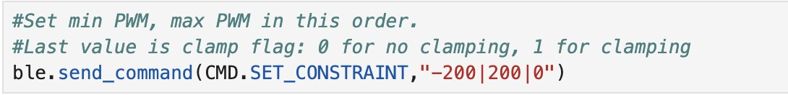
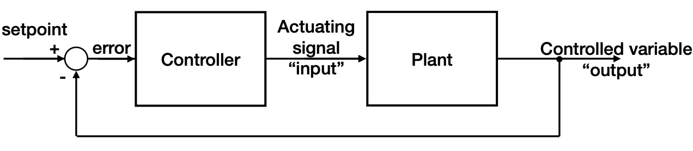
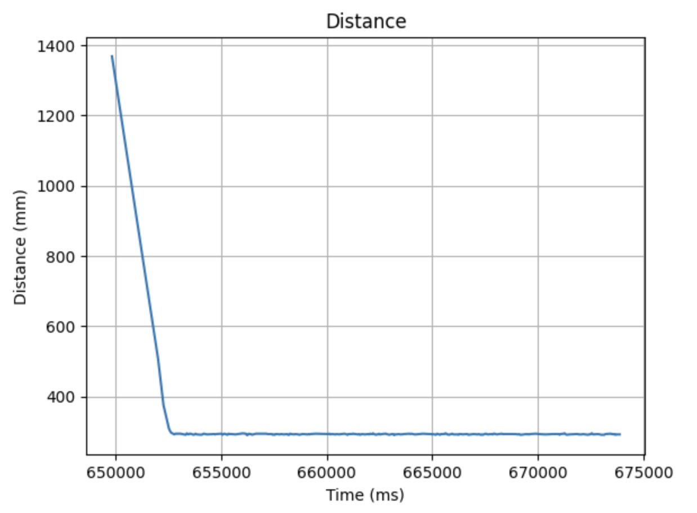
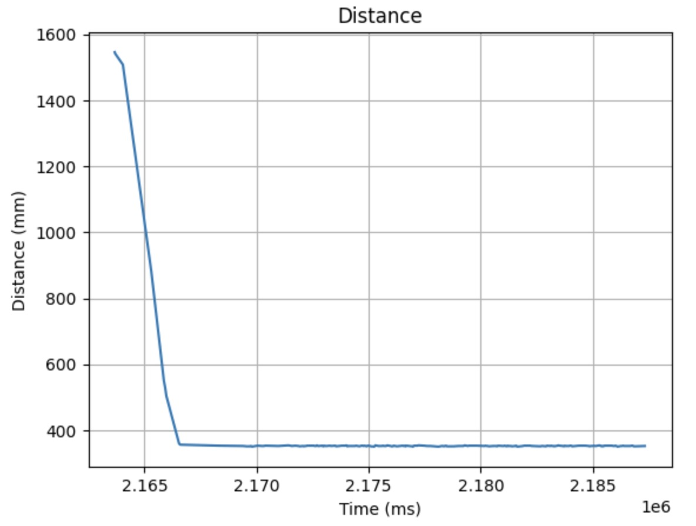
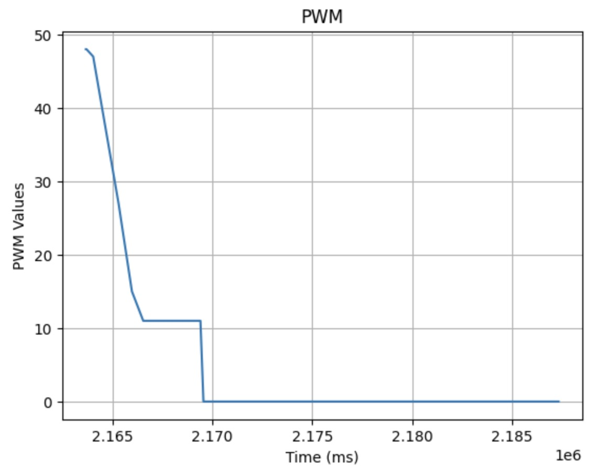

# Lab 5: Linear PID Control and Linear Interpolation
The objective of this lab

## Prelab
I began by separating my previous lab code for motor control and ToF into header and CPP files to improve code organization. Additionally, I created a new header file specifically for my PID control functions. Due to time constraints, I have not yet created a header file for my IMU code. The header files are shown below.

Motor header file:

ToF header file:

### Bluetooth Commands
Next, I wrote Bluetooth commands to set parameters and control the start and stop of my PID code from my computer.

The **SET_PID_PARAM** command sets PI parameters (Kp and Ki) and activates a tweak flag, which adjusts the PI calculation. This adjustment is discussed later in the implementation.

Arduino side:

Python side:

The **SET_CONSTRAINT** allows me to choose PWM value limits to cap speed and prevent the robot from hitting the wall too hard. I can also set the flag for clamp here which turns on and off clamping for wind-up protection.

Arduino side:

Python side:

The **START_RUN** command allows me to set the target distance (setpoint) and PID runtime, then executes PI control for the specified duration. The PI implementation will be discussed further in the implementation section. Lastly, it sends timestamped data, including distances, PWM values, P terms, and I terms, to the computer afterward for plotting.

Arduino side:

Python side:

I also implement a hard stop in the main loop if the Bluetooth connection fails as safety measure.

### PI Discussion and Implementation
The PID equation and block digram from Professor Helbling's slides are shown.

In essence, the PID control equation combines three components to adjust a system's behavior. The Proportional term responds to the current error, the Integral term accounts for past errors to eliminate steady-state error, and the Derivative term predicts future errors based on the rate of change. Together, these components work to minimize error and improve system stability and accuracy.

I implemented only PI control because, through experimentation, I found it sufficient to make the robot stop 1 foot away from the wall. The P term provided effective control, while the I term helped with fine-tuning the small and persistent errors. There are no substantial fluctuations or fast changes in the system that would necessitate the D term, particularly since there is no speed requirement for this lab.

In the START_RUN function, I use a while loop to implement PI control for the desired duration, ensuring ample data storage with arrays. I compute the time step (dt) for the integral control and then update the PI values using the linear_pid function, provided the ToF sensor has data.At the end of the loop, I manage forward and backward movement based on the sign of the adjusted PWM value from the PI calculation.

In my **linear_pid** function, I implement PI according to the equation. I also apply a tweak to the PID control when the flag is activated. This tweak takes a sliding average of the last five errors and checks if it is less than 50mm. If it is, the PWM value is set to 0, stopping the car. This ensures the car stops just before reaching its target distance, giving it enough time to come to a complete stop by the time it reaches the target. While the PID control equation should theoretically work as shown in the slides, in practice, this adjustment is necessary because my motors are imperfect.

I also include my clamping code for wind-up protection in my linear_pid function. The clamp flag, activated in SET_CONSTRAINT, controls the conditional that encompasses the clamping code.

## Lab Tasks

### Position Control

#### Proportional (P) Control
First, I implemented proportional control. I started with an estimate using the following calculation.

Kp = 0.04.

<iframe width="560" height="315" src="https://www.youtube.com/embed/6NMo0ybRPp8"
    frameborder="0" allow="accelerometer; autoplay; clipboard-write; encrypted-media; gyroscope; picture-in-picture"
    allowfullscreen>
</iframe>

___
#### Proportional Integral (PI) Control
I dec
PI control without clamping: Kp = 0.032 and Ki = 0.01

<iframe width="560" height="315" src="https://www.youtube.com/embed/x92iKCiqwtM" frameborder="0" allow="accelerometer; autoplay; encrypted-media; gyroscope; picture-in-picture" allowfullscreen></iframe>

Two other runs of my PI control are shown.

<iframe width="560" height="315" src="https://www.youtube.com/embed/TsQqXjffLiI" frameborder="0" allowfullscreen></iframe>

<iframe width="560" height="315" src="https://www.youtube.com/embed/44w_pQgWc-4" frameborder="0" allow="accelerometer; autoplay; encrypted-media; gyroscope; picture-in-picture" allowfullscreen></iframe>

___
### Extrapolation
Using the same methods from previous labs, I calculated the frequency at which the ToF sensor returns new data: ~9.94 Hz

PID speed 121.25 Hz.

#### Extrapolation Using Previous Datapoint
Video with old point
Graph with old data point

#### Linear Interpolation

Video with linear Interpolation
Graph with linear interpolation

### Wind-Up Protection for Integrator
The integrator term in my controller caused a wind-up issue. The accumulated error increased rapidly and could not shrink fast enough as the robot approached the target distance. This issue caused my car to drive directly into the cabinet as shown below.

#### No Wind-up Protection
<iframe width="560" height="315" src="https://www.youtube.com/embed/ITvxpkxNnqw" frameborder="0" allow="accelerometer; autoplay; encrypted-media; gyroscope; picture-in-picture" allowfullscreen></iframe>

#### Wind-Up Protection
To fix this issue, I implemented clamping in the code below using the logic shown in Professor Helbling's slides. The accumulated error is reset to 0 when the controller is clamped, helping to prevent oversaturation.

Two videos of my wind-up integrator protection code are shown (Kp=0.05 and Ki = 0.01).
<iframe width="560" height="315" src="https://www.youtube.com/embed/nPRK794NF8k" frameborder="0" allow="accelerometer; autoplay; encrypted-media; gyroscope; picture-in-picture" allowfullscreen></iframe>

<iframe width="560" height="315" src="https://www.youtube.com/embed/8rM_LcwEsAo" frameborder="0" allow="accelerometer; autoplay; encrypted-media; gyroscope; picture-in-picture" allowfullscreen></iframe>

___
## References
I referenced pages written by Nila and Stephen. I also discussed ideas with Sabian, Becky, and Nita.
