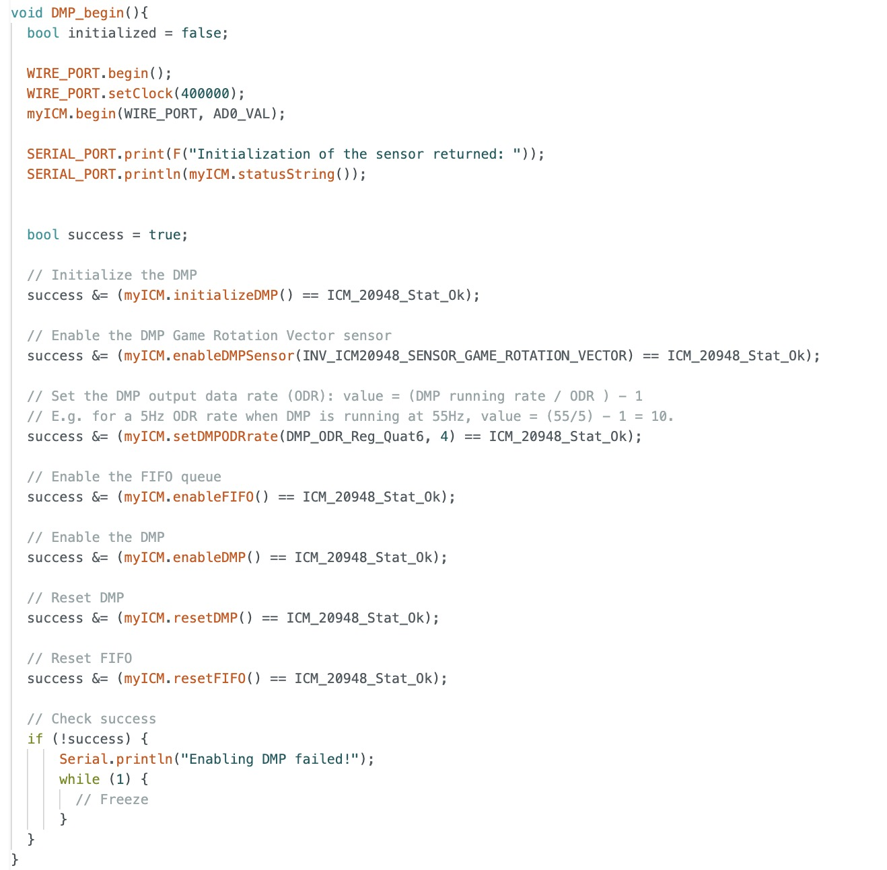
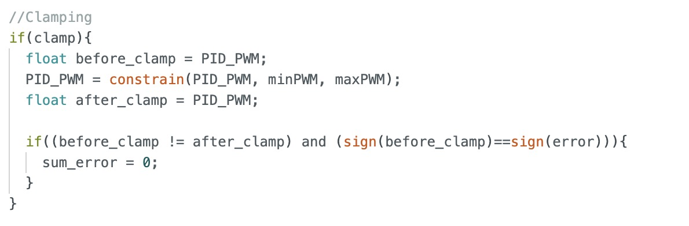

# Lab 6: Orientation Control

## Prelab
In Lab 6, I built upon my Lab 5 code by using case statements for PID control and adjusting the Kp and Ki values.

### PID Input Signal
Remembering how much drift affected my yaw measurement in Lab 2, I decided to test out the Digital Motion Processor in the InvenSense ICM-20948 sensor instead. Here is a video of the DMP example code running with the visualizer.
<iframe width="560" height="315" src="https://www.youtube.com/embed/VRjVanpF9zI" frameborder="0" allow="accelerometer; autoplay; encrypted-media; gyroscope; picture-in-picture" allowfullscreen></iframe>
___
The gyroscope data alone introduced drift over time due to the accumulation of small errors, which led to increasing orientation inaccuracies. While bias correction and calibration could help, the drift was still nontrivial. I switched to the DMP because it mitigates this by fusing data from the gyroscope, accelerometer, and magnetometer, reducing drift and providing more stable yaw measurements. This sensor fusion improves orientation tracking and helps stabilize the yaw value when the robot is stationary. However, enabling the DMP requires extra memory on the microcontroller and modifications to the SparkFun ICM-20948 Arduino library.

After making the decision to to switch from using the gyroscope data alone to using the DMP, I organized the DMP code into a separate header and CPP file like how I did with the ToF sensor code in Lab 5.

DMP.h is shown below.

DMP.cpp is shown below.

### Bluetooth Commands
The Bluetooth commands I added for orientation PID are displayed. Like in Lab 5, they allow me to set parameters and control the start/stop of my orientation PID code from my computer.

I am reusing the **SET_PID_PARAM** command which sets PI parameters (Kp and Ki). This command can change the parameter values while my controller is running.

Arduino side:

Python side:

I am also reusing the **SET_CONSTRAINT** command which allows me to choose PWM value limits to cap the turn speed. I can also set the flag for clamping here, which enables or disables wind-up protection for the integral term.

Arduino side:

Python side:

The **START_ORIENT_PID** command allows me to set the target angle (set point) and PID runtime, then executes PI control for the specified duration. After executing the control, it sends timestamped data, including angles, PWM values, P terms, and I terms, to the computer for plotting. The PI control implementation will be covered in the next section.

Arduino side:

Python side:

I retained the hard stop from before in the main loop as a safety measure in case the Bluetooth connection fails.

### PI Discussion and Implementation
The following explanation was discussed in my Lab 5 webpage but is repeated here for context. "The PID equation and block digram from Professor Helbling's slides are shown.

In essence, the PID control equation combines three components to adjust a system's behavior. The Proportional term responds to the current error, the Integral term accounts for past errors to eliminate steady-state error, and the Derivative term predicts future errors based on the rate of change. Together, these components work to minimize error and improve system stability and accuracy."

------
Like lab 5, I implemented only PI control because, through experimentation, I found it sufficient to make the robot turned to the target angle. The P term provided effective control, while the I term helped with fine-tuning the small and persistent errors. Since the robot is turning so slowly, and I'm lightly kicking the robot as opposed to punting it across the room, there are no substantial fluctuations or fast changes in the system that would necessitate the D term.

I implemented my START_ORIENT_PID code very similarly to my linear PID code, I use a while loop to implement PI control for the desired duration. I compute the time step (dt) for the integral control and then update the PI values using the orient_pid function. At the end of the loop, I manage the turn direction based on the sign of the adjusted PWM value from the PI calculation.

In my **orient_pid** function, I implement PI according to the equation.

I also include my clamping code for wind-up protection in my orient_pid function. The clamp flag, activated in SET_CONSTRAINT, controls the conditional that encompasses the clamping code.

## Lab Tasks

### Orientation Control

#### Proportional (P) Control
First, I implemented proportional control.

Kp = 0.04.

<iframe width="560" height="315" src="https://www.youtube.com/embed/6NMo0ybRPp8"
    frameborder="0" allow="accelerometer; autoplay; clipboard-write; encrypted-media; gyroscope; picture-in-picture"
    allowfullscreen>
</iframe>

___
#### Proportional Integral (PI) Control
After finding Kp, I loosely followed heuristic 1 in the slides and increased Ki until overshoot and then slowly reduced the Ki until it was gone. I primarily looked at the car's ability to return to the set point, using this as a key indicator of effective tuning.

PI control without clamping: Kp = 0.032 and Ki = 0.01

<iframe width="560" height="315" src="https://www.youtube.com/embed/x92iKCiqwtM" frameborder="0" allow="accelerometer; autoplay; encrypted-media; gyroscope; picture-in-picture" allowfullscreen></iframe>

___

### Derivative Term Discussion
Although, I did not use a derivate term in my controller, I will address the discussion points written in the handout on a high level. Taking the derivative of an integrated signal is valid because it reflects how the accumulated error changes over time, allowing for a response based on past behavior. However, this can cause derivative kick when the set point changes suddenly, leading to large spikes in the derivative term. To mitigate this, it's better to apply the derivative to the error directly and use a low-pass filter to smooth out high-frequency noise.

### Sampling Frequency With the DMP
Using the same methods from previous labs, I calculated the frequency at which the DMP could return new data: ~44.73 Hz.

This is still much slower than the decoupled PID loop frequency, which I calculated to be approximately 121.25 Hz. As before, the sensor remains the limiting factor in the loop speed.

### Wind-Up Protection for Integrator
The integrator term in my controller caused a wind-up issue as expected. The accumulated error increased rapidly and could not shrink fast enough as the robot approached the target angle. This issue caused my car to continuously spin in circles.

#### No Wind-up Protection
<iframe width="560" height="315" src="https://www.youtube.com/embed/ITvxpkxNnqw" frameborder="0" allow="accelerometer; autoplay; encrypted-media; gyroscope; picture-in-picture" allowfullscreen></iframe>

_____

#### Wind-Up Protection
To fix this issue, I implemented clamping in the code below using the logic shown in Professor Helbling's slides. The accumulated error is reset to 0 when the controller is clamped, helping to prevent oversaturation.

___
## References
I heavily referenced Professor Helbling's slides. I also referenced my own lab 5 page. I discussed ideas with Becky.
