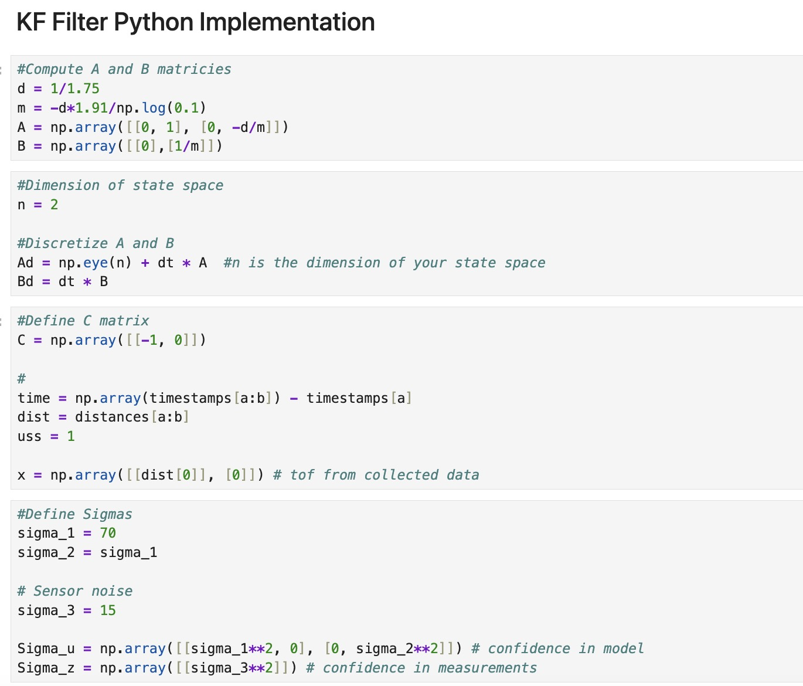

# Lab 7: Kalman Filter

## Drag and Momentum Estimation

I use a step response to estimate drag and momentum by initially setting the PWM to 0 and then applying a constant PWM value. I chose a PWM of 100, which is about 39% of the maximum PWM used in my linear PID lab, instead of the recommended 50-100% of the maximum u, because the robot moved too quickly at higher PWM values, making it difficult to collect a sufficient number of data points.

The distance and velocity graphs are shown below. In the velocity graph, you can see that the velocity settles on a value of ~1700 mm/s at time ~2.12s. I estimate the 90% rise time to be ~1.91s. The speed at 90% rise time is ~1666 mm/s. This estimate is based on my fitted velocity graph, though the fit isn't perfect and doesn't accurately capture the settling at the end. I had difficulty adjusting the fitted curve so I have attached my best attempt.

The following equations can be used to calculate drag and momentum.

For ease of calculation, I converted my values to SI units before performing the calculations.

## Kalman Filter Implementation in Python (Simulation)

The estimated model parameters done using calculations is decently accurate, but does not follow the data too closely. Here, sigma1 = sigma2 = 70 and sigma 3 = 15.

Putting more trust in our model, the Kalman graph deviates from my measurements too much. Here, sigma1 = sigma2 = 50 and sigma 3 = 50.

Putting more trust in our measurements, the Kalman graph matches the measurements almost exactly. Here, sigma1 = sigma2 = 180 and sigma 3 = 45.

## Kalman Filter Implementation on the Robot

<iframe width="560" height="315" src="https://www.youtube.com/embed/kqI4PpA5Q6U" frameborder="0" allow="accelerometer; autoplay; encrypted-media; gyroscope; picture-in-picture" allowfullscreen></iframe>

___
## References
I heavily referenced Professor Helbling's slides and pages written by Stephan and Mikayla. I discussed ideas with Becky and Sabian.
