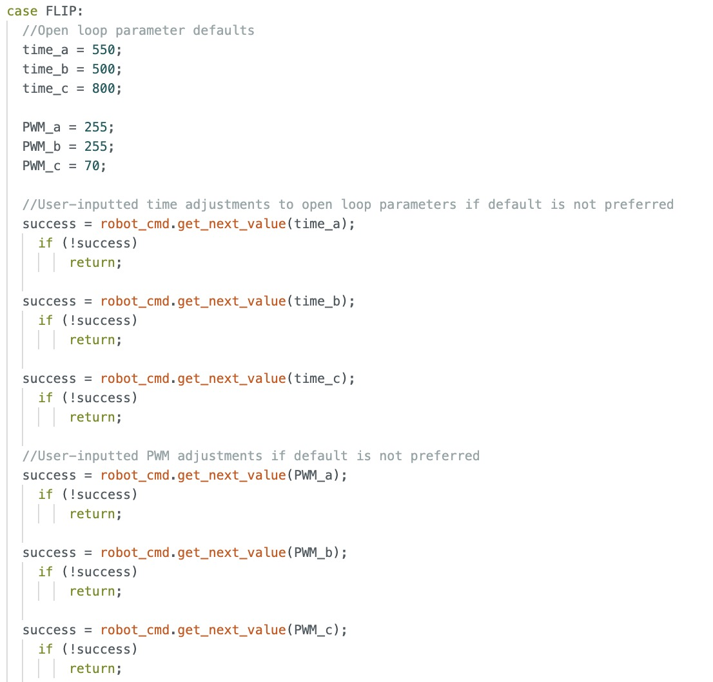
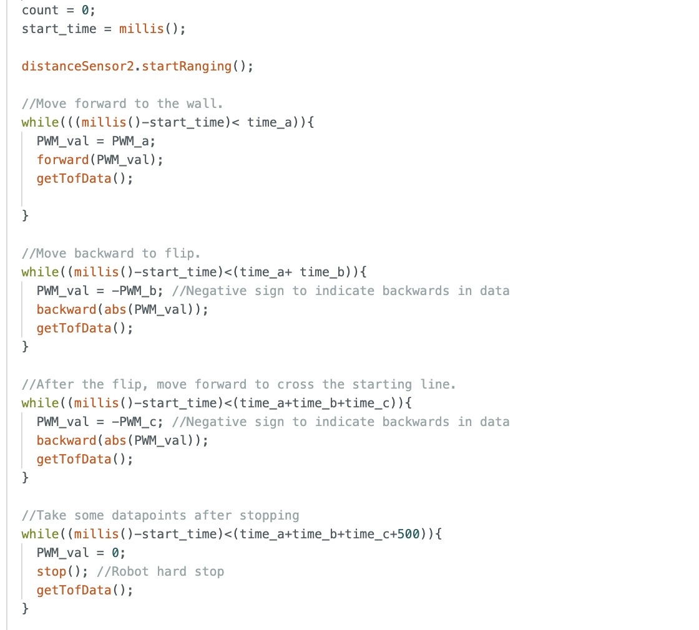
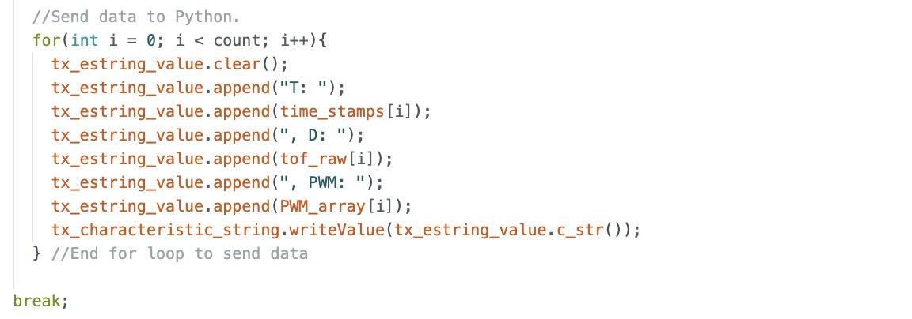
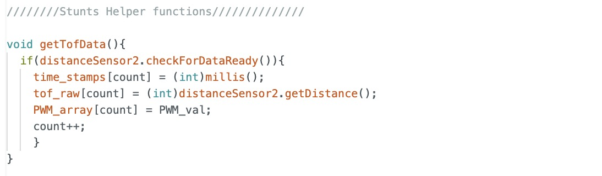
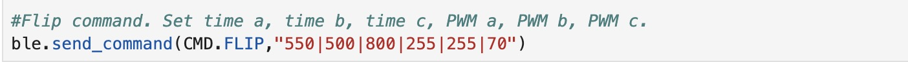
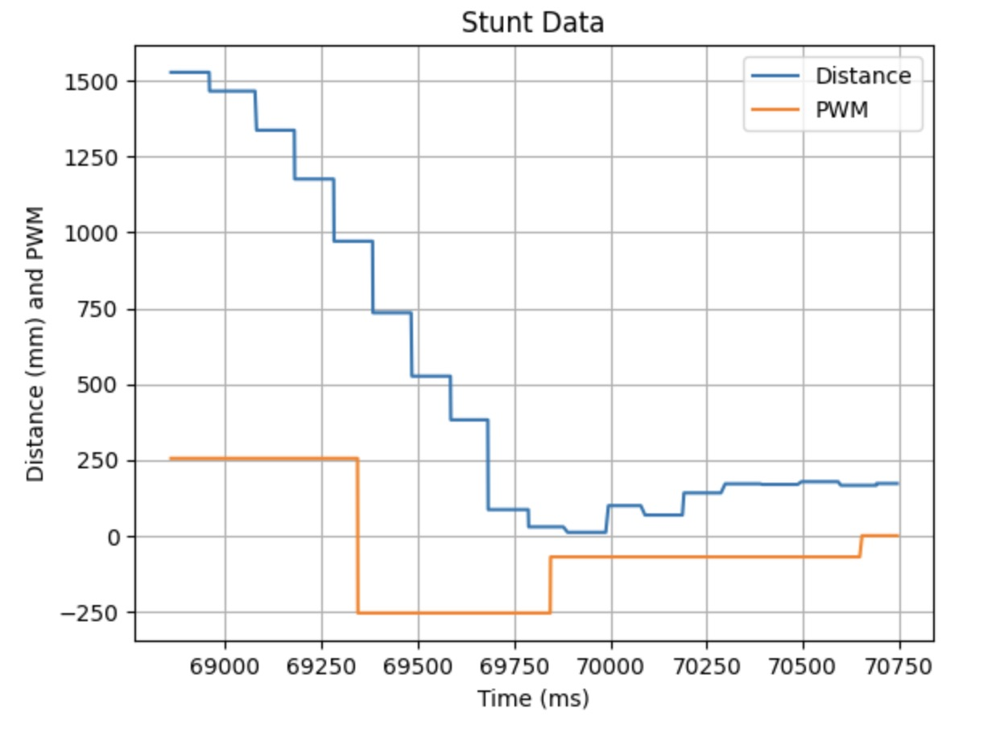
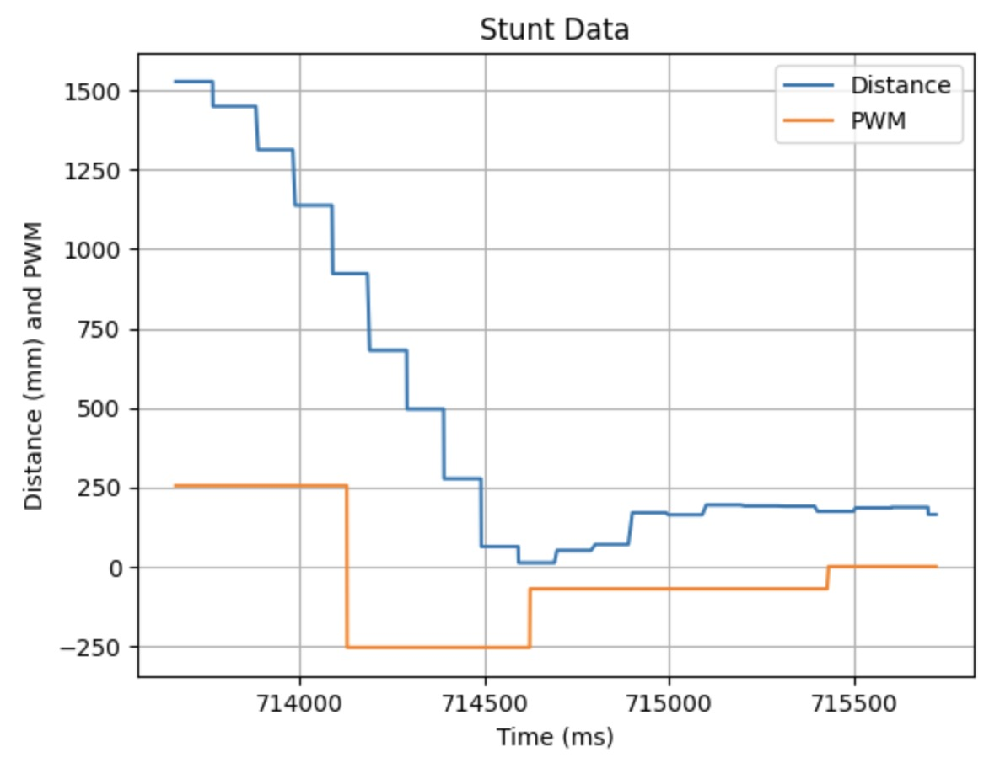
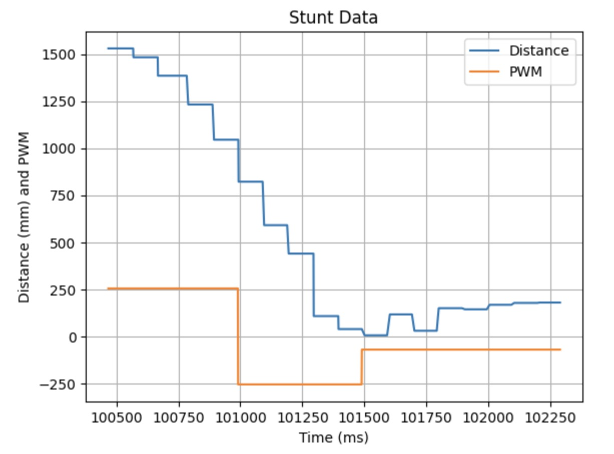

# Lab 8: Stunts

In this lab, the robot begins on a starting line 1.5 m away from the wall, moves forward until it is ~1ft from the wall, performs a flip, and then drives back through the starting line.

Note: In previous years, students were required to perform the stunt on the lab track. However, since this lab coincided with spring break, Professor Helbling allowed us to complete it at home instead.

## Flip Implementation
While linear PID could have been used for this stunt, I opted for open-loop control during the flip to allow the robot to accelerate at full speed and build up the momentum needed to complete the maneuver. Additionally, my robot layout decision from lab 4 placing both batteries at the front of the car provided it with the forward weight distribution that made the open-loop flip effective.

On the Arduino side, I wrote a FLIP command that executes the flip stunt and allows me to adjust the open-loop parameters in each run. After testing, I finalized the open-loop parameters that consistently produced reliable results and applied the same settings for each run, configuring them directly in the command call from my Python script.

**Arduino Code:**

Helper Function For Storing data

**Python Command:**

## Flip Videos

### Flip Run 1
**Stunt Completion Time:** 1.93s

<iframe width="560" height="315" src="https://www.youtube.com/embed/XyZOh4HU9a8" frameborder="0" allow="accelerometer; autoplay; encrypted-media; gyroscope; picture-in-picture" allowfullscreen></iframe>

___

### Flip Run 2
**Stunt Completion Time:** 2.08s

<iframe width="560" height="315" src="https://www.youtube.com/embed/IG5O3Za6K4k" frameborder="0" allow="accelerometer; autoplay; encrypted-media; gyroscope; picture-in-picture" allowfullscreen></iframe>

___

### Flip Run 3
**Stunt Completion Time:** 2.00s

<iframe width="560" height="315" src="https://www.youtube.com/embed/H5lXT2y9cxg" frameborder="0" allow="accelerometer; autoplay; encrypted-media; gyroscope; picture-in-picture" allowfullscreen></iframe>

___

Note: In all the demo graphs, the data for the return trip after the flip are inaccurate because there is a window that reaches down to the ground behind my setup (picture shown below). I figured the return data, was not important since the robot just needed to cross the line to finish the stunt and I used open loop all the way through. If I needed more accurate return data, I would have bought another poster board.

## Bloopers
___
## References
 I referenced Wenyi's page. I discussed ideas with Becky and Akshati.
