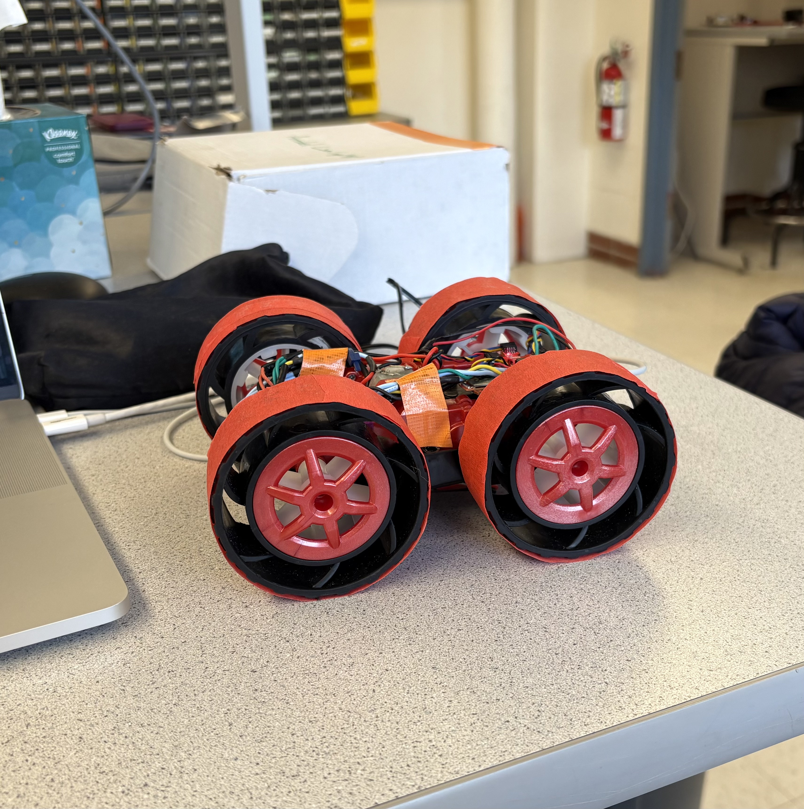

# Lab 9: Mapping

In Lab 9, I used my robot to build a map of a static room that can later support localization and navigation tasks in subsequent labs. The robot is placed at marked locations around the lab, where it spins in place while simultaneously collecting time-of-flight sensor distance data.

## Orientation Control
I used my orientation PI control from Lab 6 to spin my robot on axis in 10-degree increments, pausing at each step to collect time-of-flight distance data before continuing until it completed a full rotation.

To organize the code and make this easier,  I created a **run_orientPI** function that executes the PI controller to reach a specified setpoint over a set time interval. I also added a helper function, **pause**, to stop the robot and collect distance measurements.

In my **MAP** case statement, I use a for loop to increment the angles.

To help the robot overcome static friction and start turning in small increments, I taped the wheels to make them smoother and easier to rotate. I first applied masking tape as a buffer since it doesn't leave residue on the wheels. Then, I layered duct tape on top because its slippery surface helps the robot overcome static friction more easily.

  
  

**Arduino Code:**

**Python Command:**
___

<iframe width="560" height="315" src="https://www.youtube.com/embed/lyClKZNKP94" frameborder="0" allow="accelerometer; autoplay; encrypted-media; gyroscope; picture-in-picture" allowfullscreen></iframe>

___
## References
I referenced Mikayla's page.
