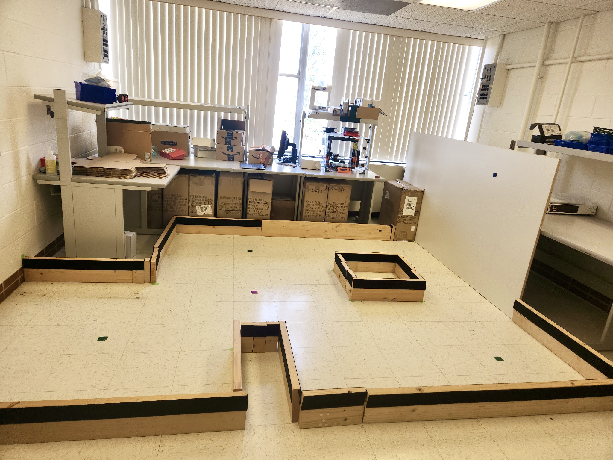
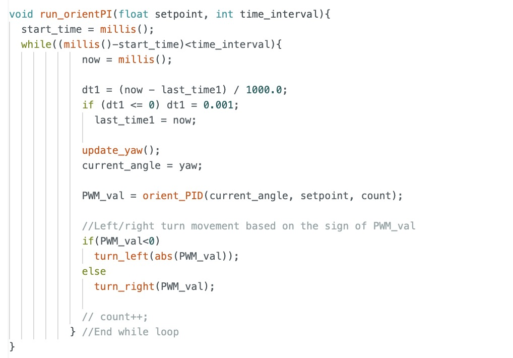
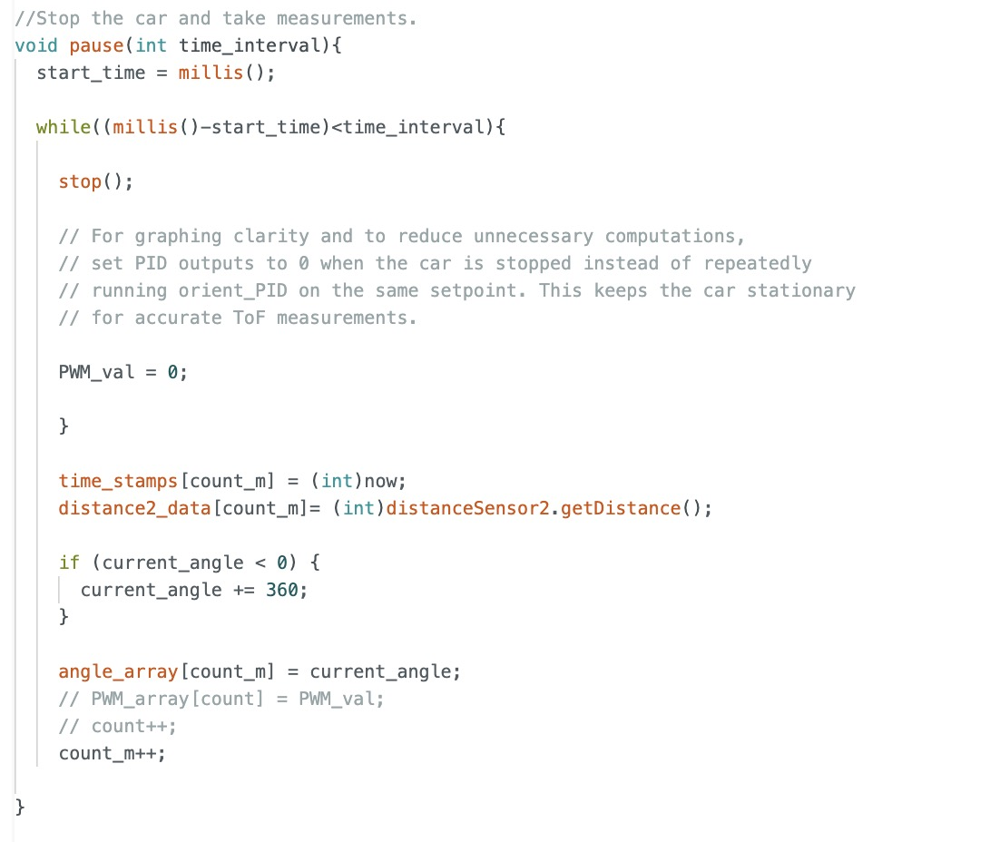
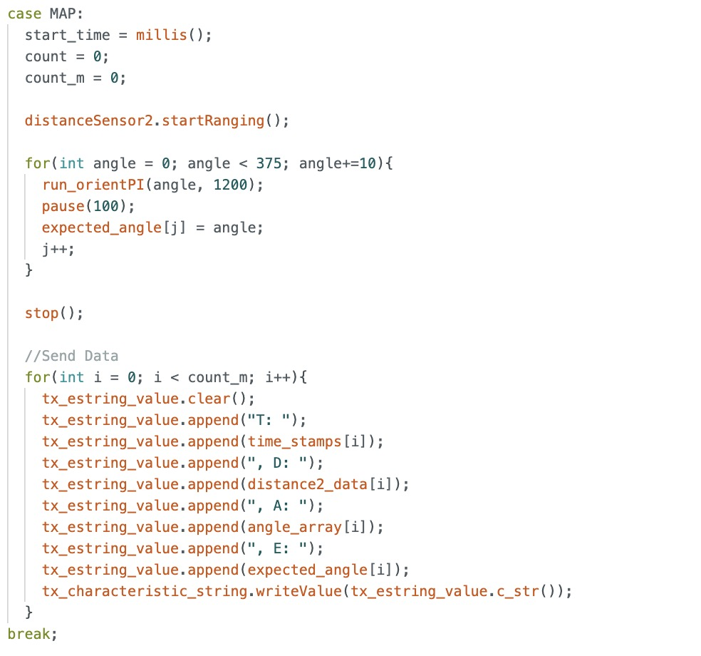

# Lab 9: Mapping

In Lab 9, I used my robot to build a map of a static room that can later support localization and navigation tasks in subsequent labs. The robot is placed at marked locations around the lab space (shown below), where it spins in place while simultaneously collecting time-of-flight sensor distance data.

## Orientation Control
To help the robot overcome static friction while spinning in place, I applied tape to the wheels. I started with masking tape as a residue-free buffer, then added a layer of smooth duct tape on top to reduce friction and allow the wheels to rotate more easily.

I used my orientation PI control from Lab 6 to spin my robot on axis in 10-degree increments, pausing at each step to collect time-of-flight distance data before continuing until it completed a full rotation.

I organized my code using functions so that my **MAP** command code is more concise and easier to manage. The **run_orientPI** function executes the PI controller to reach a specified setpoint over a time interval. The **pause** function stops the robot and collects distance measurements for a time interval. They are both shown below.

In my **MAP** command code, I use a for loop to increment the angles, running the orientation PID at each increment and pausing to take measurements.

The video below demonstrates my orientation PI control mapping code in action. As shown, the robot can spin on axis pretty well as it remains in the 1 square foot tile.

<iframe width="560" height="315" src="https://www.youtube.com/embed/lyClKZNKP94" frameborder="0" allow="accelerometer; autoplay; encrypted-media; gyroscope; picture-in-picture" allowfullscreen></iframe>

___

## Mapping at Designated Coordinates
I executed a complete turn at the following marked coordinates in the lab space: (-3,-2), (5,3), (0,3), and (5,-3)

### Plots for Position (-3,-2)

### Plots for Position (5,3)

### Plots for Position (0,3)

### Plots for Position (5,-3)

## Conversion to Line-Based Map
To convert

___
## References
I referenced pages written by Wenyi and Mikayla. I also worked with Becky and Akshati. Lastly, I used Professor Helbling's transformation matrices slides.
