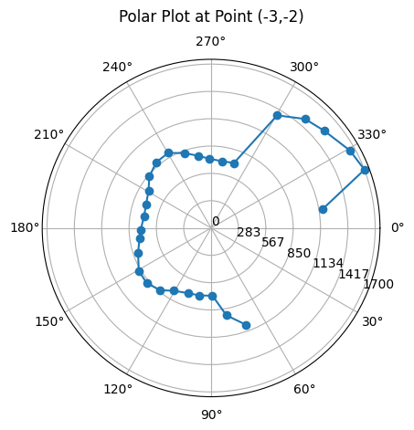
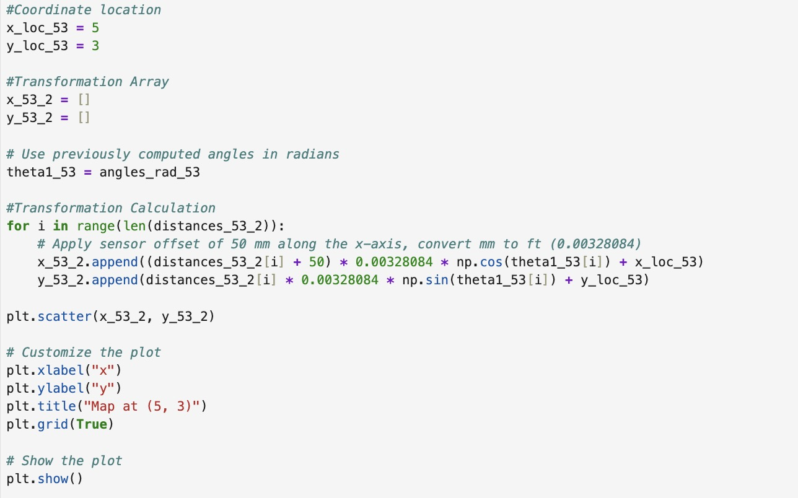
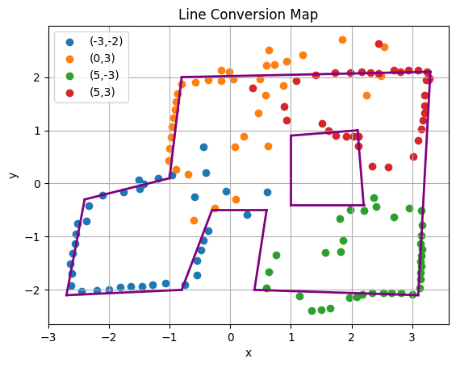

# Lab 9: Mapping

In Lab 9, I used my robot to build a map of a static room that can later support localization and navigation tasks in subsequent labs. The robot is placed at marked locations around the lab space (shown below), where it spins in place while simultaneously collecting time-of-flight sensor distance data.

## PI Orientation Control
To help the robot overcome static friction while spinning in place, I applied tape to the wheels. I started with masking tape as a residue-free buffer, then added a layer of smooth duct tape on top to reduce friction and allow the wheels to rotate more easily.

I used my orientation PI control from Lab 6 to spin my robot on axis in 10-degree increments, pausing at each step to collect time-of-flight distance data before continuing until it completed a full rotation. I am using the DMP to measure the robot's yaw.

I organized my code using functions so that my **MAP** command code is more concise and easier to manage. The **run_orientPI** function executes the PI controller to reach a specified setpoint over a time interval.

The **pause** function stops the robot and collects distance measurements for a time interval. The DMP's range is -180 to 180 degrees so I convert the measured angle to a range of 0 to 360 to make later calculations easier.

In my **MAP** command code, I use a for loop to increment the angles, running the orientation PID at each increment and pausing movement to take measurements. I run the orientation PID function for 1.2s for each increment so that it has plenty of time to reach the setpoint. Once it reaches the setpoint, it stops or pauses its rotation for 100 ms allowing adequate time for the ToF sensors to measure data without being affected by noise due to rotational movement.

This code performed reasonably well. When I plotted the expected and measured angles over time, the measured angle generally tracked the expected angle, even if it wasn’t a perfect match. Below is the graph for one of the data points. Note: The initial points near 360 degrees were a result of angle wrapping. I attempted to start the robot at 0 degrees, but it was challenging to align it perfectly.

The video below demonstrates my orientation PI control mapping code in action. As shown, the robot can spin on axis pretty well as it always remains in the 1 square foot tile. I think on average my error would be around 5 inches and maximally 10 inches when completing its spin.

<iframe width="560" height="315" src="https://www.youtube.com/embed/lyClKZNKP94" frameborder="0" allow="accelerometer; autoplay; encrypted-media; gyroscope; picture-in-picture" allowfullscreen></iframe>

___

## Mapping at Designated Coordinates
I executed a complete turn at the following marked coordinates in the lab space: (-3,-2), (5,3), (0,3), and (5,-3)

The following code snippet shows an example of how I generated a polar plot. The polar plots allowed me to sanity check each mapping run to make sure I was capturing the general shape of the environment, though it is quite obvious there is noise from other cars and people stepping into the environment. False distances from the ToF sensor may have also contributed to some odd points.

### Plots for Position (-3,-2)

### Plots for Position (5,3)

### Plots for Position (0,3)

### Plots for Position (5,-3)

### Mapping Precision
Ideally, I would have liked more time to graph additional runs. However, the limited open hours and the restriction on how many robots could map the environment at once made that difficult. In the tests I conducted, the data appeared to be fairly consistent. Here is data from one of my quick tests. The points are clustered rather closely in a similar pattern.

## Conversion to Line-Based Map
The following transformation matrix T is used to convert sensor data into Cartesian coordinates for mapping. The left part of T represents a rotation by angle ψ, and the rightmost column is a translation vector d. The original point P is transformed using P′ = T·P. Note: P must be expressed in homogeneous coordinates.

An example code snippet implementing the above for a coordinate location in the robot environment is shown. It is important to account for the ToF sensor offset from the robot's spinning axis. Since my ToF sensor is centered and 50 mm away from the center, I add that to the x calculation. I also converted my distances from millimeters to feet since each tile represents one square foot and serves as the basis for the environment’s coordinate system.

To draw the line-based map manually, I wrote a draw_line function that draws a line between two coordinates. The coordinates for the lines are shown and will be entered into the simulator in the next lab. My map decently captures the general shape of the lab environment. However, there is a lot of noise captured as well. As said before, the noise could be due to false ToF sensor readings due to drastic movement and the other robots in the environment while mine was operating.

___
## References
I referenced pages written by Wenyi, Daria, and Mikayla. I also worked with Becky and Akshati. Lastly, I used Professor Helbling's transformation matrices slides.
